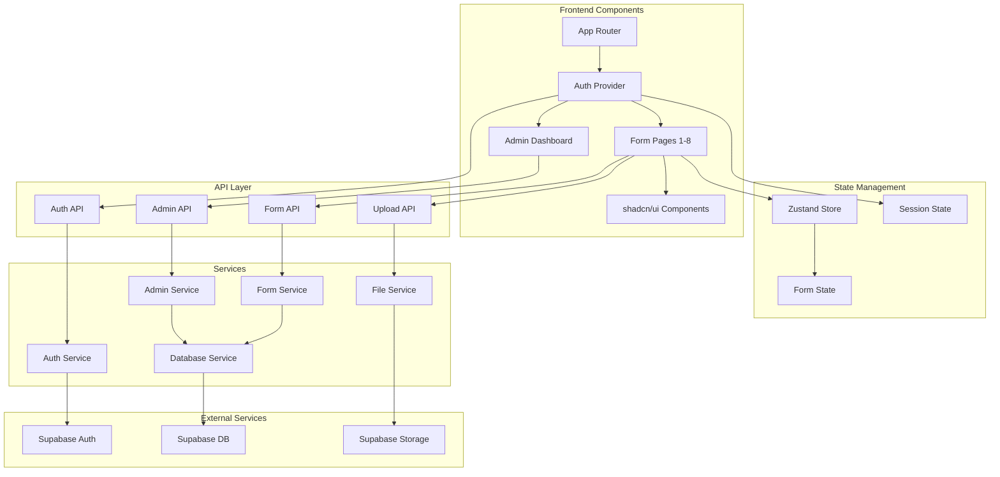
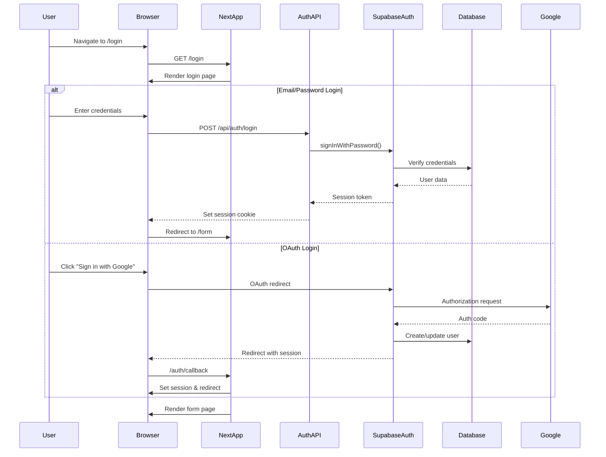
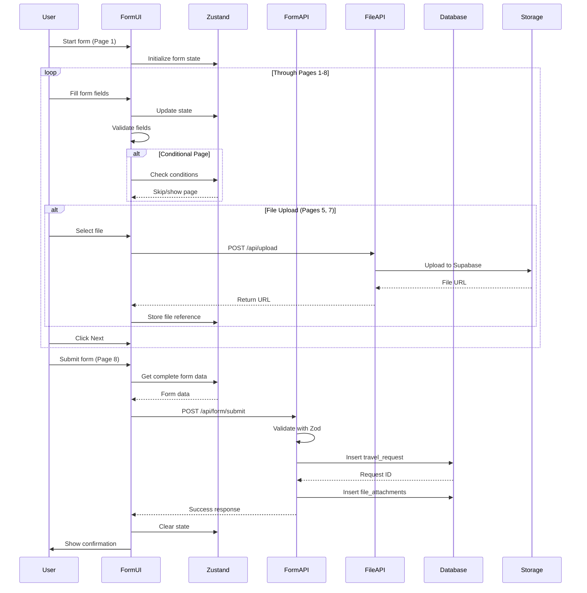
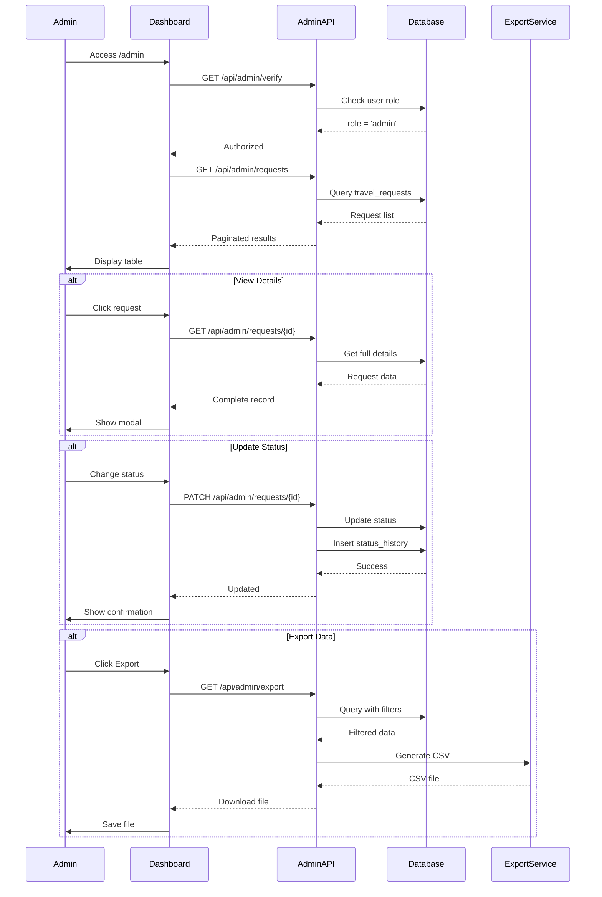
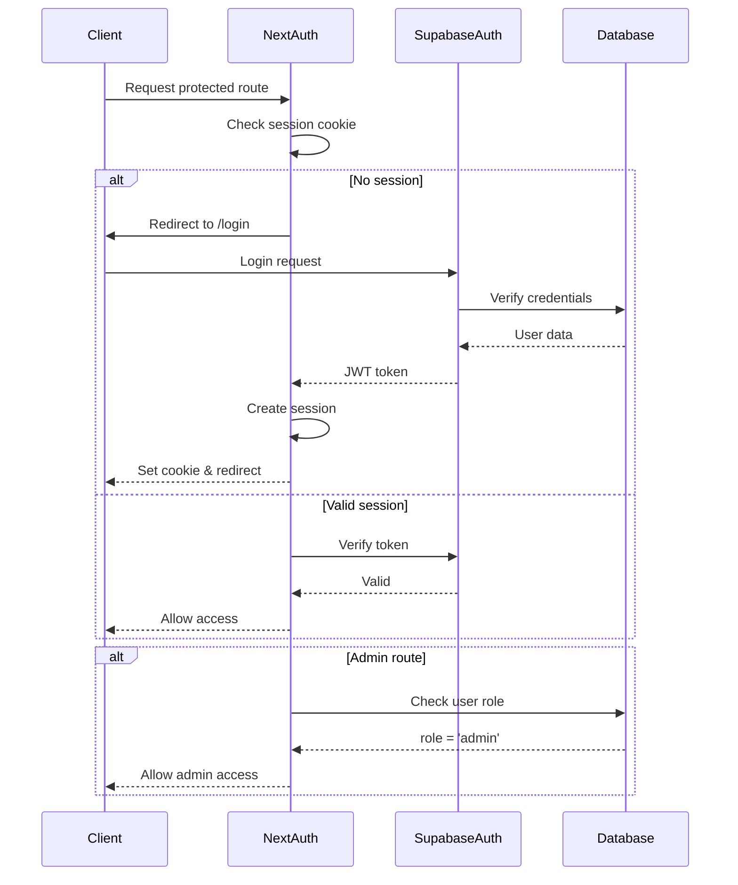
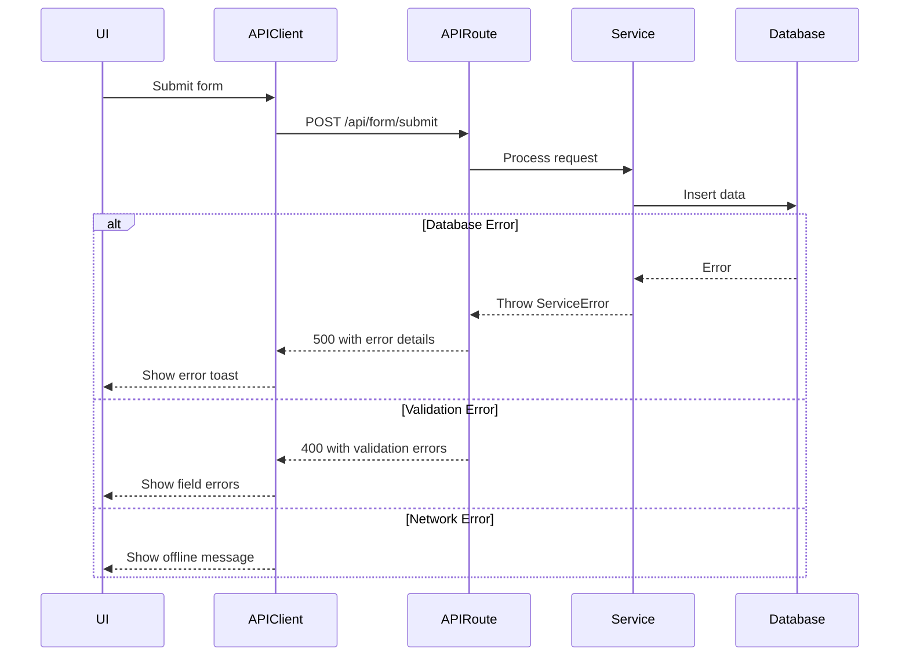

# Travel Request Form System Fullstack Architecture Document

## Introduction

This document outlines the complete fullstack architecture for Travel Request Form System, including backend systems, frontend implementation, and their integration. It serves as the single source of truth for AI-driven development, ensuring consistency across the entire technology stack.

This unified approach combines what would traditionally be separate backend and frontend architecture documents, streamlining the development process for modern fullstack applications where these concerns are increasingly intertwined.

### Starter Template or Existing Project

**Decision:** Greenfield project with Turborepo monorepo structure as specified in the PRD. No starter template used - custom implementation to match specific CEIA requirements.

### Change Log

| Date | Version | Description | Author |
|------|---------|-------------|--------|
| 2025-08-11 | 1.0 | Initial architecture document created from PRD | Winston (Architect) |
| 2025-10-19 | 1.1 | Updated with database enhancements and cloud migration | Winston (Architect) |

## High Level Architecture

### Technical Summary

The Travel Request Form System employs a **monolithic Next.js 15.3 architecture** deployed as a single fullstack application with integrated API routes, leveraging Supabase for authentication, database, and file storage. The frontend utilizes React 19 with TypeScript, shadcn/ui components, and Zustand for state management to deliver a multi-step form experience. Backend functionality is implemented through Next.js API routes connecting to a local Supabase PostgreSQL instance, with Row Level Security policies ensuring data isolation. The infrastructure leverages Docker for local Supabase deployment and targets Node.js-compatible hosting platforms, achieving the PRD goals of replicating Microsoft Forms functionality while adding database persistence and setting foundation for future enhancements.

### Platform and Infrastructure Choice

**Platform:** Cloud Development with Supabase Cloud + Production on Vercel
**Key Services:**
- Supabase Cloud (PostgreSQL, Auth, Storage) - sa-east-1 region
- Next.js 15.3 with App Router
- Vercel for production hosting

**Deployment Host and Regions:**
- Development: Supabase Cloud (South America - sa-east-1)
- Production: Vercel (Global Edge Network)
- Database: Supabase Cloud (South America region for CEIA)

**Migration Note (October 2025):** System migrated from local Docker Supabase to Supabase Cloud. See Epic 5 documentation for migration details.

### Repository Structure

**Structure:** Monorepo
**Monorepo Tool:** Turborepo
**Package Organization:** 
- apps/web (Next.js application)
- packages/shared (shared types and utilities)
- packages/ui (shared components if needed)

### High Level Architecture Diagram

```mermaid
graph TB
    subgraph "Client Layer"
        Browser[Web Browser]
        Mobile[Mobile Browser]
    end
    
    subgraph "CDN/Edge"
        Vercel[Vercel Edge Network]
    end
    
    subgraph "Application Layer"
        NextApp[Next.js 15.3 App]
        subgraph "Frontend"
            React[React 19 + TypeScript]
            Zustand[Zustand State]
            ShadcnUI[shadcn/ui Components]
        end
        subgraph "API Routes"
            AuthAPI[/api/auth/*]
            FormAPI[/api/form/*]
            AdminAPI[/api/admin/*]
            UploadAPI[/api/upload]
        end
    end
    
    subgraph "Data Layer"
        subgraph "Supabase"
            SupaAuth[Supabase Auth]
            SupaDB[(PostgreSQL)]
            SupaStorage[Supabase Storage]
            SupaRLS[Row Level Security]
        end
    end
    
    subgraph "External Services"
        Google[Google OAuth]
        Microsoft[Microsoft OAuth]
    end
    
    Browser --> Vercel
    Mobile --> Vercel
    Vercel --> NextApp
    React --> Zustand
    React --> ShadcnUI
    React --> AuthAPI
    React --> FormAPI
    React --> AdminAPI
    React --> UploadAPI
    AuthAPI --> SupaAuth
    FormAPI --> SupaDB
    AdminAPI --> SupaDB
    UploadAPI --> SupaStorage
    SupaAuth --> Google
    SupaAuth --> Microsoft
    SupaDB --> SupaRLS
```

### Architectural Patterns

- **Jamstack Architecture:** Static generation where possible with dynamic API routes - _Rationale:_ Optimal performance for form pages while maintaining dynamic data capabilities
- **Component-Based UI:** Reusable React components with TypeScript and shadcn/ui - _Rationale:_ Maintainability, type safety, and consistent design system
- **Server Components:** Next.js 15 Server Components for initial data fetching - _Rationale:_ Reduced client bundle size and improved initial load performance
- **API Routes Pattern:** Next.js API routes as backend - _Rationale:_ Simplified deployment and unified codebase for MVP
- **State Management Pattern:** Zustand for client-side form state - _Rationale:_ Lightweight solution perfect for multi-step form persistence
- **Row Level Security:** Supabase RLS for data isolation - _Rationale:_ Database-level security ensuring users only access their data
- **File Upload Pattern:** Direct upload to Supabase Storage - _Rationale:_ Simplified file handling with built-in CDN and access control
- **Progressive Enhancement:** Form works without JavaScript where possible - _Rationale:_ Accessibility and reliability for government users

## Tech Stack

### Technology Stack Table

| Category | Technology | Version | Purpose | Rationale |
|----------|------------|---------|---------|-----------|
| Frontend Language | TypeScript | 5.3+ | Type-safe frontend development | Type safety reduces bugs in complex form logic |
| Frontend Framework | Next.js | 15.3 | React meta-framework with SSR/SSG | Latest version with App Router for modern patterns |
| UI Component Library | shadcn/ui | latest | Customizable component library | Beautiful, accessible components with full control |
| State Management | Zustand | 4.5+ | Client-side state management | Simple, lightweight for form state persistence |
| State Management | TanStack Query | 5.80+ | Server state management | Efficient data fetching and caching for API calls |
| Form Management | TanStack Form | 1.12+ | Advanced form state | Complex form validation and state handling |
| Backend Language | TypeScript | 5.3+ | Type-safe backend development | Shared types between frontend and backend |
| Backend Framework | Next.js API Routes | 15.3 | Integrated backend in Next.js | Simplified deployment and development |
| API Style | REST | - | RESTful API design | Simple, well-understood pattern for CRUD operations |
| Database | PostgreSQL (Supabase) | 15+ | Primary data storage | Robust, relational database for structured data |
| Cache | Next.js Cache | Built-in | Page and data caching | Automatic caching with ISR support |
| File Storage | Supabase Storage | latest | File upload storage | Integrated with auth and database |
| Authentication | Supabase Auth | latest | User authentication | Built-in OAuth and email auth |
| Frontend Testing | Vitest | 1.0+ | Unit and component testing | Fast, Vite-based testing |
| Backend Testing | Vitest | 1.0+ | API testing | Consistent testing across stack |
| E2E Testing | Playwright | 1.40+ | End-to-end testing | Modern, reliable browser automation |
| Build Tool | Turborepo | 1.11+ | Monorepo build orchestration | Efficient builds with caching |
| Bundler | Webpack (via Next.js) | 5.x | Module bundling | Built into Next.js |
| IaC Tool | Docker Compose | 2.x | Local infrastructure | Local Supabase deployment |
| CI/CD | GitHub Actions | - | Continuous integration/deployment | Free for public repos, Vercel integration |
| Monitoring | Vercel Analytics | latest | Performance monitoring | Built-in with Vercel deployment |
| Logging | Console + Vercel | - | Application logging | Simple logging for MVP |
| CSS Framework | TailwindCSS | 3.4+ | Utility-first styling | Rapid development with consistent design |

## Data Models

### TravelRequest
**Purpose:** Core entity representing a complete travel request submission with all passenger, travel, and administrative details

**Key Attributes:**
- id: string (CUID) - Unique request identifier
- requestNumber: string - Human-readable request number (REQ-2025-XXXX)
- userId: string - Reference to authenticated user
- status: enum - Request status (submitted, under_review, approved, rejected, completed)
- createdAt: timestamp - Submission timestamp
- updatedAt: timestamp - Last modification timestamp

#### TypeScript Interface
```typescript
interface TravelRequest {
  id: string;
  requestNumber: string;
  userId: string;
  status: 'submitted' | 'under_review' | 'approved' | 'rejected' | 'completed';
  
  // Passenger Data (Page 1)
  projectName: string;
  passengerName: string;
  passengerEmail: string;
  rg: string;
  rgIssuer: string;
  cpf: string;
  birthDate: Date;
  phone: string;
  bankDetails: string;  // Legacy field - maintained for backwards compatibility

  // Structured Bank Data (Added October 2025)
  bankName?: string;          // Bank institution name (from bancos_brasileiros)
  bankBranch?: string;        // Agência number
  bankAccount?: string;       // Account number

  requestType: 'passages_per_diem' | 'passages_only' | 'per_diem_only';
  
  // Travel Details (Page 2)
  origin: string;
  destination: string;
  departureDate: Date;
  returnDate: Date;
  transportType: 'air' | 'road' | 'both' | 'own_car';
  
  // Expense Types (Page 3)
  expenseTypes: string[];
  
  // Preferences (Page 4)
  baggageAllowance: boolean;
  transportAllowance: boolean;
  estimatedDailyAllowance: number;
  
  // International Travel (Page 5 - conditional)
  isInternational: boolean;
  passportNumber?: string;
  passportValidity?: Date;
  passportImageUrl?: string;
  visaRequired?: boolean;
  
  // Time Restrictions (Page 6 - conditional)
  hasTimeRestrictions: boolean;
  timeRestrictionDetails?: string;
  
  // Flight Preferences (Page 7 - conditional)
  hasFlightPreferences: boolean;
  flightSuggestionUrls?: string[];
  
  // Trip Objective (Page 8)
  tripObjective: string;
  observations?: string;
  isUrgent: boolean;
  urgentJustification?: string;
  
  createdAt: Date;
  updatedAt: Date;
}
```

#### Relationships
- Belongs to User (via userId)
- Has many StatusHistory entries
- Has many FileAttachments

### User
**Purpose:** Authenticated user who can submit travel requests and potentially access admin functions

**Key Attributes:**
- id: string (UUID) - Supabase Auth UUID
- email: string - User email address
- name: string - Full name
- role: enum - User role (user, admin)
- createdAt: timestamp - Account creation

#### TypeScript Interface
```typescript
interface User {
  id: string;
  email: string;
  name: string;
  role: 'user' | 'admin';
  metadata?: {
    department?: string;
    employeeId?: string;
  };
  createdAt: Date;
  lastLogin: Date;
}
```

#### Relationships
- Has many TravelRequests
- Managed by Supabase Auth

### StatusHistory
**Purpose:** Audit trail of status changes for travel requests

**Key Attributes:**
- id: string - History entry ID
- requestId: string - Reference to TravelRequest
- previousStatus: enum - Status before change
- newStatus: enum - Status after change
- changedBy: string - User who made the change
- comment: string - Optional comment
- timestamp: timestamp - When change occurred

#### TypeScript Interface
```typescript
interface StatusHistory {
  id: string;
  requestId: string;
  previousStatus: TravelRequest['status'];
  newStatus: TravelRequest['status'];
  changedBy: string;
  comment?: string;
  timestamp: Date;
}
```

#### Relationships
- Belongs to TravelRequest
- References User (changedBy)

### FileAttachment
**Purpose:** Metadata for uploaded files associated with travel requests

**Key Attributes:**
- id: string - Attachment ID
- requestId: string - Reference to TravelRequest
- fileName: string - Original file name
- fileUrl: string - Supabase Storage URL
- fileType: string - MIME type
- fileSize: number - Size in bytes
- uploadedAt: timestamp - Upload timestamp

#### TypeScript Interface
```typescript
interface FileAttachment {
  id: string;
  requestId: string;
  fileName: string;
  fileUrl: string;
  fileType: string;
  fileSize: number;
  category: 'passport' | 'flight_suggestion' | 'other';
  uploadedAt: Date;
}
```

#### Relationships
- Belongs to TravelRequest

### Projeto (Project Reference)
**Purpose:** Reference table for CEIA projects used in travel request form dropdown

**Key Attributes:**
- id: integer (auto-increment) - Primary key
- nome: string - Project name
- codigo: string - Project code/identifier
- ativo: boolean - Whether project is active
- created_at: timestamp - Record creation

#### TypeScript Interface
```typescript
interface Projeto {
  id: number;
  nome: string;
  codigo?: string;
  ativo: boolean;
  created_at: Date;
}
```

#### Relationships
- Referenced by TravelRequest (via projectName field - not foreign key, text match)

### BancoBrasileiro (Brazilian Bank Reference)
**Purpose:** Reference table for Brazilian banking institutions used in structured bank data selection

**Key Attributes:**
- id: integer (auto-increment) - Primary key
- codigo: string - Bank code (COMPE code)
- nome_banco: string - Full bank name
- ispb: string - ISPB identifier (Brazilian banking system)

#### TypeScript Interface
```typescript
interface BancoBrasileiro {
  id: number;
  codigo: string;
  nome_banco: string;
  ispb: string;
}
```

#### Relationships
- Referenced by TravelRequest (via bankName field - not foreign key, text match)
- Contains 190+ Brazilian banking institutions

## API Specification

### REST API Specification

```yaml
openapi: 3.0.0
info:
  title: Travel Request Form API
  version: 1.0.0
  description: API for managing travel requests and administrative functions
servers:
  - url: /api
    description: Next.js API Routes

paths:
  /auth/login:
    post:
      summary: Authenticate user
      requestBody:
        required: true
        content:
          application/json:
            schema:
              type: object
              properties:
                email:
                  type: string
                password:
                  type: string
      responses:
        200:
          description: Successfully authenticated
          
  /auth/logout:
    post:
      summary: Logout current user
      responses:
        200:
          description: Successfully logged out
          
  /auth/session:
    get:
      summary: Get current session
      responses:
        200:
          description: Current user session
          
  /form/submit:
    post:
      summary: Submit travel request form
      security:
        - BearerAuth: []
      requestBody:
        required: true
        content:
          application/json:
            schema:
              $ref: '#/components/schemas/TravelRequestInput'
      responses:
        201:
          description: Request created successfully
          content:
            application/json:
              schema:
                type: object
                properties:
                  id:
                    type: string
                  requestNumber:
                    type: string
                    
  /form/draft:
    post:
      summary: Save form draft
      security:
        - BearerAuth: []
      requestBody:
        required: true
        content:
          application/json:
            schema:
              $ref: '#/components/schemas/FormDraft'
      responses:
        200:
          description: Draft saved
          
    get:
      summary: Get saved draft
      security:
        - BearerAuth: []
      responses:
        200:
          description: Draft data
          
  /upload:
    post:
      summary: Upload file attachment
      security:
        - BearerAuth: []
      requestBody:
        required: true
        content:
          multipart/form-data:
            schema:
              type: object
              properties:
                file:
                  type: string
                  format: binary
                category:
                  type: string
                  enum: [passport, flight_suggestion]
      responses:
        200:
          description: File uploaded
          content:
            application/json:
              schema:
                type: object
                properties:
                  fileUrl:
                    type: string
                  fileId:
                    type: string
                    
  /admin/requests:
    get:
      summary: List all travel requests (admin only)
      security:
        - BearerAuth: []
      parameters:
        - in: query
          name: status
          schema:
            type: string
        - in: query
          name: search
          schema:
            type: string
        - in: query
          name: page
          schema:
            type: integer
        - in: query
          name: limit
          schema:
            type: integer
      responses:
        200:
          description: List of requests
          content:
            application/json:
              schema:
                type: object
                properties:
                  data:
                    type: array
                    items:
                      $ref: '#/components/schemas/TravelRequest'
                  total:
                    type: integer
                  page:
                    type: integer
                    
  /admin/requests/{id}:
    get:
      summary: Get request details (admin only)
      security:
        - BearerAuth: []
      parameters:
        - in: path
          name: id
          required: true
          schema:
            type: string
      responses:
        200:
          description: Request details
          
    patch:
      summary: Update request status (admin only)
      security:
        - BearerAuth: []
      parameters:
        - in: path
          name: id
          required: true
          schema:
            type: string
      requestBody:
        required: true
        content:
          application/json:
            schema:
              type: object
              properties:
                status:
                  type: string
                comment:
                  type: string
      responses:
        200:
          description: Status updated
          
  /admin/export:
    get:
      summary: Export requests to CSV (admin only)
      security:
        - BearerAuth: []
      parameters:
        - in: query
          name: format
          schema:
            type: string
            enum: [csv, excel]
      responses:
        200:
          description: Export file
          content:
            text/csv:
              schema:
                type: string

components:
  securitySchemes:
    BearerAuth:
      type: http
      scheme: bearer
      
  schemas:
    TravelRequest:
      type: object
      # Full schema as defined in TypeScript interface above
    
    TravelRequestInput:
      type: object
      # Input schema for form submission
      
    FormDraft:
      type: object
      properties:
        currentPage:
          type: integer
        formData:
          type: object
```

## Components

### Web Application (Frontend)
**Responsibility:** Next.js 15.3 application providing the user interface for travel request submission, authentication, and admin dashboard

**Key Interfaces:**
- Server Components for initial page rendering
- Client Components for interactive form elements
- API route calls via fetch with Supabase auth headers

**Dependencies:** Supabase Client, API Routes

**Technology Stack:** Next.js 15.3, React 19, TypeScript, TailwindCSS, shadcn/ui, Zustand

### Authentication Service
**Responsibility:** Manages user authentication, session management, and authorization using Supabase Auth

**Key Interfaces:**
- signIn(email, password)
- signInWithOAuth(provider)
- signOut()
- getSession()
- requireAuth() middleware

**Dependencies:** Supabase Auth

**Technology Stack:** Supabase Auth SDK, Next.js middleware

### Form Service
**Responsibility:** Handles form submission logic, validation, draft management, and persistence to database

**Key Interfaces:**
- submitForm(data)
- saveDraft(data)
- getDraft(userId)
- validateFormData(data)

**Dependencies:** Database Service, File Service

**Technology Stack:** Next.js API Routes, Zod validation, Supabase Client

### File Service
**Responsibility:** Manages file uploads for passport images and flight suggestions

**Key Interfaces:**
- uploadFile(file, category)
- getFileUrl(fileId)
- deleteFile(fileId)
- validateFile(file)

**Dependencies:** Supabase Storage

**Technology Stack:** Supabase Storage SDK, Next.js API Routes

### Admin Service
**Responsibility:** Provides administrative functions for viewing and managing travel requests

**Key Interfaces:**
- listRequests(filters, pagination)
- getRequestDetails(id)
- updateRequestStatus(id, status, comment)
- exportRequests(format, filters)

**Dependencies:** Database Service, Auth Service

**Technology Stack:** Next.js API Routes, Supabase Client with RLS

### Database Service
**Responsibility:** Abstract database operations with Supabase PostgreSQL

**Key Interfaces:**
- Supabase Client instance
- Row Level Security policies
- Database migrations
- Real-time subscriptions (future)

**Dependencies:** Supabase

**Technology Stack:** Supabase JS Client, PostgreSQL

### Component Diagrams



## External APIs

### Supabase Auth API
- **Purpose:** User authentication and session management
- **Documentation:** https://supabase.com/docs/guides/auth
- **Base URL(s):** Configured via NEXT_PUBLIC_SUPABASE_URL
- **Authentication:** Anon key for public operations, service key for admin
- **Rate Limits:** Default Supabase limits apply

**Key Endpoints Used:**
- `POST /auth/v1/token?grant_type=password` - Email/password login
- `GET /auth/v1/authorize` - OAuth authorization
- `POST /auth/v1/logout` - User logout
- `GET /auth/v1/user` - Get current user

**Integration Notes:** Uses @supabase/auth-helpers-nextjs for Next.js integration

### Supabase Database API
- **Purpose:** PostgreSQL database operations via PostgREST
- **Documentation:** https://supabase.com/docs/guides/database
- **Base URL(s):** Configured via NEXT_PUBLIC_SUPABASE_URL
- **Authentication:** RLS policies with user JWT
- **Rate Limits:** Default Supabase limits

**Key Endpoints Used:**
- `POST /rest/v1/travel_requests` - Create travel request
- `GET /rest/v1/travel_requests` - List requests
- `PATCH /rest/v1/travel_requests?id=eq.{id}` - Update request

**Integration Notes:** Row Level Security ensures data isolation per user

### Supabase Storage API
- **Purpose:** File upload and storage for documents
- **Documentation:** https://supabase.com/docs/guides/storage
- **Base URL(s):** Configured via NEXT_PUBLIC_SUPABASE_URL
- **Authentication:** RLS policies on storage buckets
- **Rate Limits:** 5GB bandwidth per month (free tier)

**Key Endpoints Used:**
- `POST /storage/v1/object/{bucket}/{path}` - Upload file
- `GET /storage/v1/object/{bucket}/{path}` - Download file
- `DELETE /storage/v1/object/{bucket}/{path}` - Delete file

**Integration Notes:** Files stored in 'travel-documents' bucket with user-scoped paths

## Core Workflows

### User Authentication Flow


### Multi-Step Form Submission Flow


### Admin Dashboard Workflow


## Database Schema

```sql
-- Enable UUID extension for Supabase Auth integration
CREATE EXTENSION IF NOT EXISTS "uuid-ossp";

-- Users table (managed by Supabase Auth)
-- This references auth.users but adds app-specific fields
CREATE TABLE public.profiles (
    id UUID PRIMARY KEY REFERENCES auth.users(id) ON DELETE CASCADE,
    email TEXT UNIQUE NOT NULL,
    name TEXT,
    role TEXT DEFAULT 'user' CHECK (role IN ('user', 'admin')),
    metadata JSONB DEFAULT '{}',
    created_at TIMESTAMPTZ DEFAULT NOW(),
    last_login TIMESTAMPTZ
);

-- Travel Requests table
CREATE TABLE public.travel_requests (
    id TEXT PRIMARY KEY DEFAULT gen_random_uuid()::text,
    request_number TEXT UNIQUE NOT NULL,
    user_id UUID NOT NULL REFERENCES auth.users(id),
    status TEXT NOT NULL DEFAULT 'submitted' 
        CHECK (status IN ('submitted', 'under_review', 'approved', 'rejected', 'completed')),
    
    -- Passenger Data (Page 1)
    project_name TEXT NOT NULL,
    passenger_name TEXT NOT NULL,
    passenger_email TEXT NOT NULL,
    rg TEXT NOT NULL,
    rg_issuer TEXT NOT NULL,
    cpf TEXT NOT NULL,
    birth_date DATE NOT NULL,
    phone TEXT NOT NULL,
    bank_details TEXT NOT NULL,
    request_type TEXT NOT NULL 
        CHECK (request_type IN ('passages_per_diem', 'passages_only', 'per_diem_only')),
    
    -- Travel Details (Page 2)
    origin TEXT NOT NULL,
    destination TEXT NOT NULL,
    departure_date DATE NOT NULL,
    return_date DATE NOT NULL,
    transport_type TEXT NOT NULL 
        CHECK (transport_type IN ('air', 'road', 'both', 'own_car')),
    
    -- Expense Types (Page 3)
    expense_types TEXT[] DEFAULT '{}',
    
    -- Preferences (Page 4)
    baggage_allowance BOOLEAN DEFAULT false,
    transport_allowance BOOLEAN DEFAULT false,
    estimated_daily_allowance NUMERIC(10,2) DEFAULT 0,
    
    -- International Travel (Page 5 - conditional)
    is_international BOOLEAN DEFAULT false,
    passport_number TEXT,
    passport_validity DATE,
    passport_image_url TEXT,
    visa_required BOOLEAN DEFAULT false,
    
    -- Time Restrictions (Page 6 - conditional)
    has_time_restrictions BOOLEAN DEFAULT false,
    time_restriction_details TEXT,
    
    -- Flight Preferences (Page 7 - conditional)
    has_flight_preferences BOOLEAN DEFAULT false,
    flight_suggestion_urls TEXT[] DEFAULT '{}',
    
    -- Trip Objective (Page 8)
    trip_objective TEXT NOT NULL,
    observations TEXT,
    is_urgent BOOLEAN DEFAULT false,
    urgent_justification TEXT,
    
    -- Metadata
    created_at TIMESTAMPTZ DEFAULT NOW(),
    updated_at TIMESTAMPTZ DEFAULT NOW()
);

-- Status History table for audit trail
CREATE TABLE public.status_history (
    id TEXT PRIMARY KEY DEFAULT gen_random_uuid()::text,
    request_id TEXT NOT NULL REFERENCES travel_requests(id) ON DELETE CASCADE,
    previous_status TEXT,
    new_status TEXT NOT NULL,
    changed_by UUID NOT NULL REFERENCES auth.users(id),
    comment TEXT,
    timestamp TIMESTAMPTZ DEFAULT NOW()
);

-- File Attachments table
CREATE TABLE public.file_attachments (
    id TEXT PRIMARY KEY DEFAULT gen_random_uuid()::text,
    request_id TEXT NOT NULL REFERENCES travel_requests(id) ON DELETE CASCADE,
    file_name TEXT NOT NULL,
    file_url TEXT NOT NULL,
    file_type TEXT NOT NULL,
    file_size INTEGER NOT NULL,
    category TEXT NOT NULL CHECK (category IN ('passport', 'flight_suggestion', 'other')),
    uploaded_at TIMESTAMPTZ DEFAULT NOW()
);

-- Form Drafts table for saving progress
CREATE TABLE public.form_drafts (
    id TEXT PRIMARY KEY DEFAULT gen_random_uuid()::text,
    user_id UUID NOT NULL REFERENCES auth.users(id) ON DELETE CASCADE,
    form_data JSONB NOT NULL,
    current_page INTEGER DEFAULT 1,
    created_at TIMESTAMPTZ DEFAULT NOW(),
    updated_at TIMESTAMPTZ DEFAULT NOW(),
    UNIQUE(user_id) -- One draft per user
);

-- Indexes for performance
CREATE INDEX idx_travel_requests_user_id ON travel_requests(user_id);
CREATE INDEX idx_travel_requests_status ON travel_requests(status);
CREATE INDEX idx_travel_requests_created_at ON travel_requests(created_at DESC);
CREATE INDEX idx_travel_requests_departure_date ON travel_requests(departure_date);
CREATE INDEX idx_status_history_request_id ON status_history(request_id);
CREATE INDEX idx_file_attachments_request_id ON file_attachments(request_id);

-- Row Level Security Policies
ALTER TABLE travel_requests ENABLE ROW LEVEL SECURITY;
ALTER TABLE status_history ENABLE ROW LEVEL SECURITY;
ALTER TABLE file_attachments ENABLE ROW LEVEL SECURITY;
ALTER TABLE form_drafts ENABLE ROW LEVEL SECURITY;
ALTER TABLE profiles ENABLE ROW LEVEL SECURITY;

-- Users can only see their own requests
CREATE POLICY "Users can view own requests" ON travel_requests
    FOR SELECT USING (auth.uid() = user_id);

-- Users can create their own requests
CREATE POLICY "Users can create own requests" ON travel_requests
    FOR INSERT WITH CHECK (auth.uid() = user_id);

-- Admins can see all requests
CREATE POLICY "Admins can view all requests" ON travel_requests
    FOR SELECT USING (
        EXISTS (
            SELECT 1 FROM profiles 
            WHERE profiles.id = auth.uid() 
            AND profiles.role = 'admin'
        )
    );

-- Admins can update any request
CREATE POLICY "Admins can update requests" ON travel_requests
    FOR UPDATE USING (
        EXISTS (
            SELECT 1 FROM profiles 
            WHERE profiles.id = auth.uid() 
            AND profiles.role = 'admin'
        )
    );

-- Similar RLS policies for other tables
CREATE POLICY "Users can manage own drafts" ON form_drafts
    FOR ALL USING (auth.uid() = user_id);

CREATE POLICY "Users can view own attachments" ON file_attachments
    FOR SELECT USING (
        EXISTS (
            SELECT 1 FROM travel_requests 
            WHERE travel_requests.id = file_attachments.request_id 
            AND travel_requests.user_id = auth.uid()
        )
    );

-- Function to generate request numbers
CREATE OR REPLACE FUNCTION generate_request_number()
RETURNS TEXT AS $$
DECLARE
    year_part TEXT;
    sequence_num INTEGER;
    new_number TEXT;
BEGIN
    year_part := EXTRACT(YEAR FROM NOW())::TEXT;
    
    SELECT COUNT(*) + 1 INTO sequence_num
    FROM travel_requests
    WHERE EXTRACT(YEAR FROM created_at) = EXTRACT(YEAR FROM NOW());
    
    new_number := 'REQ-' || year_part || '-' || LPAD(sequence_num::TEXT, 4, '0');
    
    RETURN new_number;
END;
$$ LANGUAGE plpgsql;

-- Trigger to set request number
CREATE OR REPLACE FUNCTION set_request_number()
RETURNS TRIGGER AS $$
BEGIN
    IF NEW.request_number IS NULL THEN
        NEW.request_number := generate_request_number();
    END IF;
    RETURN NEW;
END;
$$ LANGUAGE plpgsql;

CREATE TRIGGER set_request_number_trigger
    BEFORE INSERT ON travel_requests
    FOR EACH ROW
    EXECUTE FUNCTION set_request_number();

-- Trigger to update updated_at timestamp
CREATE OR REPLACE FUNCTION update_updated_at()
RETURNS TRIGGER AS $$
BEGIN
    NEW.updated_at = NOW();
    RETURN NEW;
END;
$$ LANGUAGE plpgsql;

CREATE TRIGGER update_travel_requests_updated_at
    BEFORE UPDATE ON travel_requests
    FOR EACH ROW
    EXECUTE FUNCTION update_updated_at();

CREATE TRIGGER update_form_drafts_updated_at
    BEFORE UPDATE ON form_drafts
    FOR EACH ROW
    EXECUTE FUNCTION update_updated_at();
```

### Schema Enhancements (October 2025)

#### Projects Reference Table
```sql
-- Migration: 20250115_create_projetos_table.sql
CREATE TABLE IF NOT EXISTS projetos (
    id SERIAL PRIMARY KEY,
    nome TEXT NOT NULL,
    codigo TEXT,
    ativo BOOLEAN DEFAULT true,
    created_at TIMESTAMPTZ DEFAULT NOW()
);

-- Populated with 53 CEIA projects via populate_projetos.sql
```

#### Brazilian Banks Reference Table
```sql
-- Migration: 20251017111942_create_bancos_brasileiros_table.sql
CREATE TABLE IF NOT EXISTS bancos_brasileiros (
    id SERIAL PRIMARY KEY,
    codigo TEXT NOT NULL UNIQUE,
    nome_banco TEXT NOT NULL,
    ispb TEXT
);

-- Contains 190+ Brazilian banking institutions
CREATE INDEX idx_bancos_codigo ON bancos_brasileiros(codigo);
```

#### Structured Bank Fields Enhancement
```sql
-- Migration: 20251017_220000_add_structured_bank_fields.sql
ALTER TABLE public.travel_requests
ADD COLUMN IF NOT EXISTS bank_name TEXT,
ADD COLUMN IF NOT EXISTS bank_branch TEXT,
ADD COLUMN IF NOT EXISTS bank_account TEXT;

-- Comments and index
COMMENT ON COLUMN public.travel_requests.bank_name IS 'Name of the banking institution';
COMMENT ON COLUMN public.travel_requests.bank_branch IS 'Bank branch number (agência)';
COMMENT ON COLUMN public.travel_requests.bank_account IS 'Bank account number';
CREATE INDEX IF NOT EXISTS idx_travel_requests_bank_name ON public.travel_requests(bank_name);

-- Note: bank_details column maintained for backwards compatibility
```

## Frontend Architecture

### Component Architecture

#### Component Organization
```
apps/web/src/components/
├── ui/                      # shadcn/ui components
│   ├── button.tsx
│   ├── form.tsx
│   ├── input.tsx
│   └── ...
├── layout/                  # Layout components
│   ├── header.tsx
│   ├── footer.tsx
│   └── background.tsx
├── form/                    # Form-specific components
│   ├── form-layout.tsx     # Multi-step form wrapper
│   ├── progress-bar.tsx    # Form progress indicator
│   ├── navigation.tsx      # Previous/Next buttons
│   └── pages/             # Individual form pages
│       ├── passenger-data.tsx
│       ├── travel-details.tsx
│       └── ...
├── admin/                   # Admin dashboard components
│   ├── requests-table.tsx
│   ├── request-detail.tsx
│   ├── status-badge.tsx
│   └── filters.tsx
└── auth/                    # Authentication components
    ├── login-form.tsx
    ├── signup-form.tsx
    └── auth-guard.tsx
```

#### Component Template
```typescript
// Example: Form page component template
'use client';

import { useFormStore } from '@/stores/form-store';
import { Button } from '@/components/ui/button';
import { Input } from '@/components/ui/input';
import { z } from 'zod';
import { useForm } from 'react-hook-form';
import { zodResolver } from '@hookform/resolvers/zod';

const pageSchema = z.object({
  passengerName: z.string().min(1, 'Nome é obrigatório'),
  passengerEmail: z.string().email('Email inválido'),
  // ... other fields
});

type PageData = z.infer<typeof pageSchema>;

interface PassengerDataPageProps {
  onNext: () => void;
  onPrevious: () => void;
}

export function PassengerDataPage({ onNext, onPrevious }: PassengerDataPageProps) {
  const { formData, updateFormData } = useFormStore();
  
  const form = useForm<PageData>({
    resolver: zodResolver(pageSchema),
    defaultValues: formData.passengerData || {},
  });
  
  const handleSubmit = (data: PageData) => {
    updateFormData({ passengerData: data });
    onNext();
  };
  
  return (
    <form onSubmit={form.handleSubmit(handleSubmit)} className="space-y-6">
      {/* Form fields */}
      <div className="flex justify-between">
        <Button type="button" variant="outline" onClick={onPrevious}>
          Anterior
        </Button>
        <Button type="submit">
          Próximo
        </Button>
      </div>
    </form>
  );
}
```

### State Management Architecture

#### State Structure
```typescript
// stores/form-store.ts
import { create } from 'zustand';
import { persist } from 'zustand/middleware';

interface FormState {
  currentPage: number;
  formData: Partial<TravelRequestInput>;
  
  // Actions
  setCurrentPage: (page: number) => void;
  updateFormData: (data: Partial<TravelRequestInput>) => void;
  resetForm: () => void;
  
  // Computed
  isInternational: () => boolean;
  hasTimeRestrictions: () => boolean;
  hasFlightPreferences: () => boolean;
}

export const useFormStore = create<FormState>()(
  persist(
    (set, get) => ({
      currentPage: 1,
      formData: {},
      
      setCurrentPage: (page) => set({ currentPage: page }),
      
      updateFormData: (data) => 
        set((state) => ({
          formData: { ...state.formData, ...data }
        })),
      
      resetForm: () => set({ currentPage: 1, formData: {} }),
      
      isInternational: () => {
        const destination = get().formData.destination;
        return destination ? !destination.includes('Brasil') : false;
      },
      
      hasTimeRestrictions: () => 
        get().formData.hasTimeRestrictions === true,
      
      hasFlightPreferences: () => 
        get().formData.hasFlightPreferences === true,
    }),
    {
      name: 'travel-form-storage',
    }
  )
);
```

#### State Management Patterns
- Form state persisted to localStorage via Zustand persist middleware
- Page navigation updates stored in state
- Conditional page rendering based on form selections
- Auto-save draft every 30 seconds during form completion
- Clear state on successful submission

### Routing Architecture

#### Route Organization
```
apps/web/src/app/
├── (auth)/                  # Auth group layout
│   ├── login/
│   │   └── page.tsx
│   └── signup/
│       └── page.tsx
├── (protected)/             # Protected routes
│   ├── form/
│   │   ├── layout.tsx      # Form layout wrapper
│   │   └── [page]/
│   │       └── page.tsx    # Dynamic page routing
│   ├── confirmation/
│   │   └── page.tsx
│   └── admin/
│       ├── layout.tsx      # Admin layout
│       ├── page.tsx        # Dashboard
│       └── requests/
│           └── [id]/
│               └── page.tsx
├── api/                     # API routes
│   ├── auth/
│   ├── form/
│   ├── upload/
│   └── admin/
├── layout.tsx               # Root layout
└── page.tsx                 # Landing/redirect
```

#### Protected Route Pattern
```typescript
// app/(protected)/layout.tsx
import { redirect } from 'next/navigation';
import { createServerComponentClient } from '@supabase/auth-helpers-nextjs';
import { cookies } from 'next/headers';

export default async function ProtectedLayout({
  children,
}: {
  children: React.ReactNode;
}) {
  const supabase = createServerComponentClient({ cookies });
  
  const {
    data: { session },
  } = await supabase.auth.getSession();
  
  if (!session) {
    redirect('/login');
  }
  
  return <>{children}</>;
}
```

### Frontend Services Layer

#### API Client Setup
```typescript
// services/api-client.ts
import { createClientComponentClient } from '@supabase/auth-helpers-nextjs';

class ApiClient {
  private supabase = createClientComponentClient();
  
  private async getAuthHeaders() {
    const { data: { session } } = await this.supabase.auth.getSession();
    return {
      'Authorization': `Bearer ${session?.access_token}`,
      'Content-Type': 'application/json',
    };
  }
  
  async post<T>(url: string, data?: unknown): Promise<T> {
    const headers = await this.getAuthHeaders();
    const response = await fetch(url, {
      method: 'POST',
      headers,
      body: JSON.stringify(data),
    });
    
    if (!response.ok) {
      throw new Error(`API Error: ${response.statusText}`);
    }
    
    return response.json();
  }
  
  async get<T>(url: string): Promise<T> {
    const headers = await this.getAuthHeaders();
    const response = await fetch(url, {
      method: 'GET',
      headers,
    });
    
    if (!response.ok) {
      throw new Error(`API Error: ${response.statusText}`);
    }
    
    return response.json();
  }
  
  async uploadFile(file: File, category: string): Promise<{ fileUrl: string }> {
    const formData = new FormData();
    formData.append('file', file);
    formData.append('category', category);
    
    const { data: { session } } = await this.supabase.auth.getSession();
    
    const response = await fetch('/api/upload', {
      method: 'POST',
      headers: {
        'Authorization': `Bearer ${session?.access_token}`,
      },
      body: formData,
    });
    
    if (!response.ok) {
      throw new Error('Upload failed');
    }
    
    return response.json();
  }
}

export const apiClient = new ApiClient();
```

#### Service Example
```typescript
// services/form-service.ts
import { apiClient } from './api-client';
import { TravelRequestInput } from '@/types';

export const formService = {
  async submitForm(data: TravelRequestInput) {
    return apiClient.post<{ id: string; requestNumber: string }>(
      '/api/form/submit',
      data
    );
  },
  
  async saveDraft(data: Partial<TravelRequestInput>) {
    return apiClient.post('/api/form/draft', data);
  },
  
  async getDraft() {
    return apiClient.get<Partial<TravelRequestInput>>('/api/form/draft');
  },
  
  async uploadPassport(file: File) {
    return apiClient.uploadFile(file, 'passport');
  },
  
  async uploadFlightSuggestion(file: File) {
    return apiClient.uploadFile(file, 'flight_suggestion');
  },
};
```

## Backend Architecture

### Service Architecture

#### Traditional Server

##### Controller/Route Organization
```
apps/web/src/app/api/
├── auth/
│   ├── login/
│   │   └── route.ts
│   ├── logout/
│   │   └── route.ts
│   └── session/
│       └── route.ts
├── form/
│   ├── submit/
│   │   └── route.ts
│   └── draft/
│       └── route.ts
├── upload/
│   └── route.ts
└── admin/
    ├── requests/
    │   ├── route.ts
    │   └── [id]/
    │       └── route.ts
    └── export/
        └── route.ts
```

##### Controller Template
```typescript
// app/api/form/submit/route.ts
import { NextRequest, NextResponse } from 'next/server';
import { createRouteHandlerClient } from '@supabase/auth-helpers-nextjs';
import { cookies } from 'next/headers';
import { z } from 'zod';
import { travelRequestSchema } from '@/schemas/travel-request';

export async function POST(request: NextRequest) {
  try {
    // Get session
    const supabase = createRouteHandlerClient({ cookies });
    const { data: { session } } = await supabase.auth.getSession();
    
    if (!session) {
      return NextResponse.json(
        { error: 'Unauthorized' },
        { status: 401 }
      );
    }
    
    // Parse and validate request body
    const body = await request.json();
    const validatedData = travelRequestSchema.parse(body);
    
    // Insert into database
    const { data, error } = await supabase
      .from('travel_requests')
      .insert({
        ...validatedData,
        user_id: session.user.id,
      })
      .select()
      .single();
    
    if (error) {
      console.error('Database error:', error);
      return NextResponse.json(
        { error: 'Failed to submit form' },
        { status: 500 }
      );
    }
    
    // Return success response
    return NextResponse.json({
      id: data.id,
      requestNumber: data.request_number,
    });
    
  } catch (error) {
    if (error instanceof z.ZodError) {
      return NextResponse.json(
        { error: 'Validation failed', details: error.errors },
        { status: 400 }
      );
    }
    
    console.error('Unexpected error:', error);
    return NextResponse.json(
      { error: 'Internal server error' },
      { status: 500 }
    );
  }
}
```

### Database Architecture

#### Schema Design
```sql
-- See Database Schema section above for complete SQL
```

#### Data Access Layer
```typescript
// lib/repositories/travel-request-repository.ts
import { SupabaseClient } from '@supabase/supabase-js';
import { Database } from '@/types/database';

export class TravelRequestRepository {
  constructor(private supabase: SupabaseClient<Database>) {}
  
  async create(data: any, userId: string) {
    const { data: request, error } = await this.supabase
      .from('travel_requests')
      .insert({
        ...data,
        user_id: userId,
      })
      .select()
      .single();
    
    if (error) throw error;
    return request;
  }
  
  async findById(id: string) {
    const { data, error } = await this.supabase
      .from('travel_requests')
      .select(`
        *,
        file_attachments (*),
        status_history (*)
      `)
      .eq('id', id)
      .single();
    
    if (error) throw error;
    return data;
  }
  
  async findByUser(userId: string) {
    const { data, error } = await this.supabase
      .from('travel_requests')
      .select('*')
      .eq('user_id', userId)
      .order('created_at', { ascending: false });
    
    if (error) throw error;
    return data;
  }
  
  async updateStatus(id: string, status: string, changedBy: string, comment?: string) {
    // Start transaction
    const { data: currentRequest } = await this.supabase
      .from('travel_requests')
      .select('status')
      .eq('id', id)
      .single();
    
    // Update request
    const { error: updateError } = await this.supabase
      .from('travel_requests')
      .update({ status })
      .eq('id', id);
    
    if (updateError) throw updateError;
    
    // Add history entry
    const { error: historyError } = await this.supabase
      .from('status_history')
      .insert({
        request_id: id,
        previous_status: currentRequest?.status,
        new_status: status,
        changed_by: changedBy,
        comment,
      });
    
    if (historyError) throw historyError;
  }
  
  async search(filters: any, pagination: { page: number; limit: number }) {
    let query = this.supabase
      .from('travel_requests')
      .select('*', { count: 'exact' });
    
    // Apply filters
    if (filters.status) {
      query = query.eq('status', filters.status);
    }
    if (filters.search) {
      query = query.or(`passenger_name.ilike.%${filters.search}%,request_number.ilike.%${filters.search}%`);
    }
    if (filters.dateFrom) {
      query = query.gte('departure_date', filters.dateFrom);
    }
    if (filters.dateTo) {
      query = query.lte('departure_date', filters.dateTo);
    }
    
    // Apply pagination
    const start = (pagination.page - 1) * pagination.limit;
    const end = start + pagination.limit - 1;
    query = query.range(start, end);
    
    // Order by created_at desc
    query = query.order('created_at', { ascending: false });
    
    const { data, error, count } = await query;
    
    if (error) throw error;
    
    return {
      data,
      total: count || 0,
      page: pagination.page,
      totalPages: Math.ceil((count || 0) / pagination.limit),
    };
  }
}
```

### Authentication and Authorization

#### Auth Flow


#### Middleware/Guards
```typescript
// middleware.ts
import { createMiddlewareClient } from '@supabase/auth-helpers-nextjs';
import { NextResponse } from 'next/server';
import type { NextRequest } from 'next/server';

export async function middleware(req: NextRequest) {
  const res = NextResponse.next();
  const supabase = createMiddlewareClient({ req, res });
  
  const {
    data: { session },
  } = await supabase.auth.getSession();
  
  // Check if trying to access protected routes
  if (req.nextUrl.pathname.startsWith('/form') || 
      req.nextUrl.pathname.startsWith('/admin')) {
    if (!session) {
      return NextResponse.redirect(new URL('/login', req.url));
    }
  }
  
  // Check admin routes
  if (req.nextUrl.pathname.startsWith('/admin')) {
    const { data: profile } = await supabase
      .from('profiles')
      .select('role')
      .eq('id', session.user.id)
      .single();
    
    if (profile?.role !== 'admin') {
      return NextResponse.redirect(new URL('/form', req.url));
    }
  }
  
  return res;
}

export const config = {
  matcher: ['/form/:path*', '/admin/:path*'],
};
```

## Unified Project Structure

```plaintext
trip-form-app/
├── .github/                    # CI/CD workflows
│   └── workflows/
│       ├── ci.yaml
│       └── deploy.yaml
├── apps/                       # Application packages
│   └── web/                    # Next.js application
│       ├── src/
│       │   ├── app/            # App router pages
│       │   │   ├── (auth)/     # Auth group
│       │   │   ├── (protected)/# Protected routes
│       │   │   ├── api/        # API routes
│       │   │   ├── layout.tsx
│       │   │   └── page.tsx
│       │   ├── components/     # UI components
│       │   │   ├── ui/         # shadcn/ui
│       │   │   ├── form/       # Form components
│       │   │   ├── admin/      # Admin components
│       │   │   └── auth/       # Auth components
│       │   ├── lib/            # Utilities and helpers
│       │   │   ├── supabase.ts
│       │   │   ├── utils.ts
│       │   │   └── repositories/
│       │   ├── services/       # API client services
│       │   ├── stores/         # Zustand stores
│       │   ├── schemas/        # Zod schemas
│       │   └── types/          # TypeScript types
│       ├── public/             # Static assets
│       │   ├── background.png
│       │   └── uploads/        # Local file uploads
│       ├── tests/              # Tests
│       ├── .env.local          # Environment variables
│       ├── next.config.js
│       ├── tailwind.config.ts
│       ├── tsconfig.json
│       └── package.json
├── packages/                   # Shared packages
│   └── shared/                 # Shared types/utilities
│       ├── src/
│       │   ├── types/          # Shared TypeScript interfaces
│       │   │   └── index.ts
│       │   └── constants/      # Shared constants
│       └── package.json
├── supabase/                   # Supabase configuration
│   ├── migrations/             # Database migrations
│   │   └── 001_initial_schema.sql
│   ├── config.toml            # Local config
│   └── seed.sql              # Seed data
├── docs/                       # Documentation
│   ├── prd.md
│   └── architecture.md
├── .env.example                # Environment template
├── docker-compose.yml          # Local Supabase setup
├── turbo.json                  # Turborepo configuration
├── package.json                # Root package.json
└── README.md
```

## Development Workflow

### Local Development Setup

#### Prerequisites
```bash
# Required software
node -v  # v20.x or later
npm -v   # v11.4.2 or later
docker --version  # Docker Desktop installed
git --version  # Git installed
```

#### Initial Setup
```bash
# Clone repository
git clone <repository-url>
cd trip-form-app

# Install dependencies
npm install

# Setup Supabase locally
npm run supabase:start

# Copy environment variables
cp .env.example apps/web/.env.local

# Run database migrations
npm run supabase:migrate

# Seed database (optional)
npm run supabase:seed
```

#### Development Commands
```bash
# Start all services
npm run dev

# Start frontend only
npm run dev:web

# Start backend only
# (API routes are part of Next.js, so same as frontend)

# Run tests
npm run test
npm run test:watch
npm run test:e2e
```

### Environment Configuration

#### Required Environment Variables (Cloud Configuration)
```bash
# Frontend (.env.local)
# Cloud Supabase Configuration (October 2025)
NEXT_PUBLIC_SUPABASE_URL=https://<project-ref>.supabase.co
NEXT_PUBLIC_SUPABASE_ANON_KEY=<cloud-anon-key>

# Legacy Local Configuration (for reference/rollback)
# NEXT_PUBLIC_SUPABASE_URL=http://localhost:54321
# NEXT_PUBLIC_SUPABASE_ANON_KEY=<local-anon-key>

# Backend (.env)
# Same as frontend for this monolithic architecture

# Shared
NODE_ENV=development
```

**Migration Note:** As of October 2025, the application uses Supabase Cloud. For rollback instructions to local development, see `docs/cloud-migration-rollback.md` (created in Epic 5).

## Deployment Architecture

### Deployment Strategy

**Frontend Deployment:**
- **Platform:** Vercel
- **Build Command:** `npm run build`
- **Output Directory:** `.next`
- **CDN/Edge:** Vercel Edge Network with automatic optimization

**Backend Deployment:**
- **Platform:** Vercel (same as frontend - monolithic)
- **Build Command:** Included in frontend build
- **Deployment Method:** Vercel automatic deployment from GitHub

### CI/CD Pipeline
```yaml
# .github/workflows/deploy.yaml
name: Deploy to Production

on:
  push:
    branches: [main]

jobs:
  test:
    runs-on: ubuntu-latest
    steps:
      - uses: actions/checkout@v3
      - uses: actions/setup-node@v3
        with:
          node-version: '20'
      - run: npm ci
      - run: npm run test
      - run: npm run lint
      - run: npm run type-check

  deploy:
    needs: test
    runs-on: ubuntu-latest
    steps:
      - uses: actions/checkout@v3
      - uses: vercel/action@v1
        with:
          vercel-token: ${{ secrets.VERCEL_TOKEN }}
          vercel-org-id: ${{ secrets.VERCEL_ORG_ID }}
          vercel-project-id: ${{ secrets.VERCEL_PROJECT_ID }}
          production: true
```

### Environments

| Environment | Frontend URL | Backend URL | Database | Purpose |
|-------------|-------------|-------------|----------|---------|
| Development | http://localhost:3000 | http://localhost:3000/api | Supabase Cloud (sa-east-1) | Local development |
| Staging | https://trip-form-staging.vercel.app | https://trip-form-staging.vercel.app/api | Supabase Cloud (sa-east-1) | Pre-production testing |
| Production | https://trip-form.vercel.app | https://trip-form.vercel.app/api | Supabase Cloud (sa-east-1) | Live environment |

## Security and Performance

### Security Requirements

**Frontend Security:**
- CSP Headers: `default-src 'self'; script-src 'self' 'unsafe-inline' 'unsafe-eval'; style-src 'self' 'unsafe-inline';`
- XSS Prevention: React automatic escaping + input sanitization
- Secure Storage: Sensitive data in httpOnly cookies, not localStorage

**Backend Security:**
- Input Validation: Zod schemas on all API endpoints
- Rate Limiting: Vercel Edge middleware with 100 requests/minute per IP
- CORS Policy: Same-origin only for production

**Authentication Security:**
- Token Storage: httpOnly secure cookies via Supabase
- Session Management: 7-day rolling sessions with refresh tokens
- Password Policy: Minimum 8 characters, enforced by Supabase Auth

### Performance Optimization

**Frontend Performance:**
- Bundle Size Target: < 250KB initial JS
- Loading Strategy: Code splitting with dynamic imports, progressive enhancement
- Caching Strategy: Next.js ISR with 5-minute revalidation

**Backend Performance:**
- Response Time Target: < 200ms p95 for API routes
- Database Optimization: Indexed queries, connection pooling via Supabase
- Caching Strategy: Next.js Data Cache with on-demand revalidation

## Testing Strategy

### Testing Pyramid
```
          E2E Tests
         /        \
    Integration Tests
       /            \
  Frontend Unit  Backend Unit
```

### Test Organization

#### Frontend Tests
```
apps/web/tests/
├── unit/
│   ├── components/
│   │   ├── form-pages.test.tsx
│   │   └── ui-components.test.tsx
│   └── stores/
│       └── form-store.test.ts
├── integration/
│   ├── form-flow.test.tsx
│   └── auth-flow.test.tsx
└── setup.ts
```

#### Backend Tests
```
apps/web/tests/
├── api/
│   ├── auth.test.ts
│   ├── form-submit.test.ts
│   └── admin.test.ts
└── repositories/
    └── travel-request.test.ts
```

#### E2E Tests
```
e2e/
├── form-submission.spec.ts
├── admin-dashboard.spec.ts
└── auth-flow.spec.ts
```

### Test Examples

#### Frontend Component Test
```typescript
// tests/unit/components/passenger-data.test.tsx
import { render, screen, fireEvent, waitFor } from '@testing-library/react';
import { PassengerDataPage } from '@/components/form/pages/passenger-data';

describe('PassengerDataPage', () => {
  it('validates required fields', async () => {
    const onNext = vi.fn();
    render(<PassengerDataPage onNext={onNext} onPrevious={vi.fn()} />);
    
    const submitButton = screen.getByText('Próximo');
    fireEvent.click(submitButton);
    
    await waitFor(() => {
      expect(screen.getByText('Nome é obrigatório')).toBeInTheDocument();
      expect(onNext).not.toHaveBeenCalled();
    });
  });
  
  it('saves form data to store on valid submission', async () => {
    // Test implementation
  });
});
```

#### Backend API Test
```typescript
// tests/api/form-submit.test.ts
import { POST } from '@/app/api/form/submit/route';
import { createMockRequest } from '../helpers';

describe('POST /api/form/submit', () => {
  it('rejects unauthenticated requests', async () => {
    const request = createMockRequest({
      body: { /* form data */ },
      session: null,
    });
    
    const response = await POST(request);
    expect(response.status).toBe(401);
  });
  
  it('validates form data with Zod schema', async () => {
    // Test implementation
  });
  
  it('creates travel request in database', async () => {
    // Test implementation
  });
});
```

#### E2E Test
```typescript
// e2e/form-submission.spec.ts
import { test, expect } from '@playwright/test';

test('complete form submission flow', async ({ page }) => {
  // Login
  await page.goto('/login');
  await page.fill('[name="email"]', 'test@example.com');
  await page.fill('[name="password"]', 'password123');
  await page.click('button[type="submit"]');
  
  // Navigate through form
  await expect(page).toHaveURL('/form/1');
  
  // Fill Page 1
  await page.fill('[name="passengerName"]', 'João Silva');
  await page.fill('[name="passengerEmail"]', 'joao@example.com');
  // ... more fields
  
  await page.click('text=Próximo');
  
  // Continue through pages...
  
  // Submit
  await page.click('text=Enviar Solicitação');
  
  // Verify confirmation
  await expect(page).toHaveURL(/\/confirmation/);
  await expect(page.locator('text=REQ-2025-')).toBeVisible();
});
```

## Coding Standards

### Critical Fullstack Rules
- **Type Sharing:** Always define types in packages/shared and import from there
- **API Calls:** Never make direct HTTP calls - use the service layer
- **Environment Variables:** Access only through config objects, never process.env directly
- **Error Handling:** All API routes must use the standard error handler
- **State Updates:** Never mutate state directly - use proper state management patterns
- **Form Validation:** Always validate with Zod schemas before database operations
- **File Paths:** Use absolute imports with @ alias for cleaner imports
- **Async Operations:** Always handle loading and error states in UI
- **Database Access:** Only through repository pattern, never direct Supabase calls in routes
- **Auth Checks:** Verify session in every protected API route

### Naming Conventions

| Element | Frontend | Backend | Example |
|---------|----------|---------|---------|
| Components | PascalCase | - | `UserProfile.tsx` |
| Hooks | camelCase with 'use' | - | `useAuth.ts` |
| API Routes | - | kebab-case | `/api/user-profile` |
| Database Tables | - | snake_case | `user_profiles` |

## Error Handling Strategy

### Error Flow


### Error Response Format
```typescript
interface ApiError {
  error: {
    code: string;
    message: string;
    details?: Record<string, any>;
    timestamp: string;
    requestId: string;
  };
}
```

### Frontend Error Handling
```typescript
// lib/error-handler.ts
export class ApiError extends Error {
  constructor(
    public code: string,
    public message: string,
    public details?: any
  ) {
    super(message);
  }
}

export async function handleApiResponse<T>(response: Response): Promise<T> {
  if (!response.ok) {
    const error = await response.json();
    throw new ApiError(
      error.error?.code || 'UNKNOWN_ERROR',
      error.error?.message || 'Algo deu errado',
      error.error?.details
    );
  }
  return response.json();
}

// Usage in component
try {
  const result = await formService.submitForm(data);
} catch (error) {
  if (error instanceof ApiError) {
    if (error.code === 'VALIDATION_ERROR') {
      // Show field-specific errors
      setFieldErrors(error.details);
    } else {
      // Show general error toast
      toast.error(error.message);
    }
  }
}
```

### Backend Error Handling
```typescript
// lib/api-error-handler.ts
export class ApiError extends Error {
  constructor(
    public statusCode: number,
    public code: string,
    message: string,
    public details?: any
  ) {
    super(message);
  }
}

export function errorHandler(error: unknown): NextResponse {
  console.error('API Error:', error);
  
  if (error instanceof ApiError) {
    return NextResponse.json(
      {
        error: {
          code: error.code,
          message: error.message,
          details: error.details,
          timestamp: new Date().toISOString(),
          requestId: crypto.randomUUID(),
        },
      },
      { status: error.statusCode }
    );
  }
  
  if (error instanceof z.ZodError) {
    return NextResponse.json(
      {
        error: {
          code: 'VALIDATION_ERROR',
          message: 'Dados inválidos',
          details: error.errors,
          timestamp: new Date().toISOString(),
          requestId: crypto.randomUUID(),
        },
      },
      { status: 400 }
    );
  }
  
  return NextResponse.json(
    {
      error: {
        code: 'INTERNAL_ERROR',
        message: 'Erro interno do servidor',
        timestamp: new Date().toISOString(),
        requestId: crypto.randomUUID(),
      },
    },
    { status: 500 }
  );
}
```

## Monitoring and Observability

### Monitoring Stack
- **Frontend Monitoring:** Vercel Analytics + Web Vitals
- **Backend Monitoring:** Vercel Functions monitoring
- **Error Tracking:** Sentry (optional for production)
- **Performance Monitoring:** Vercel Speed Insights

### Key Metrics
**Frontend Metrics:**
- Core Web Vitals
- JavaScript errors
- API response times
- User interactions

**Backend Metrics:**
- Request rate
- Error rate
- Response time
- Database query performance

## Checklist Results Report

_Checklist validation will be executed after document review and approval_

---

**Document Version:** 1.0  
**Created:** 2025-08-11  
**Author:** Winston (Architect)  
**Status:** READY FOR REVIEW