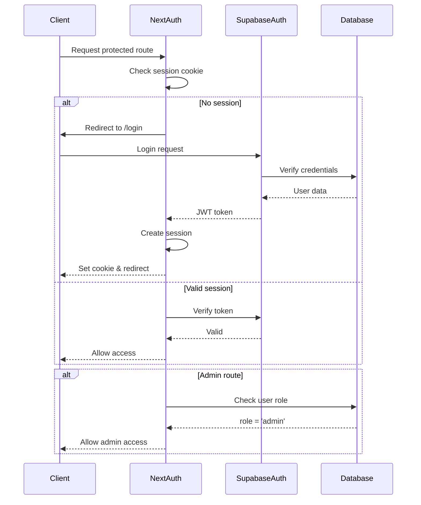

# Backend Architecture

### Service Architecture

#### Traditional Server

##### Controller/Route Organization
```
apps/web/src/app/api/
├── auth/
│   ├── login/
│   │   └── route.ts
│   ├── logout/
│   │   └── route.ts
│   ├── session/
│   │   └── route.ts
│   ├── reset-password/
│   │   └── route.ts
│   └── verify-token/
│       └── route.ts
├── form/
│   ├── submit/
│   │   └── route.ts
│   ├── draft/
│   │   └── route.ts
│   └── validate/
│       └── route.ts         # Real-time field validation
├── requests/                # User's requests management
│   ├── route.ts            # GET list, POST new
│   └── [id]/
│       ├── route.ts        # GET, PUT, DELETE
│       └── cancel/
│           └── route.ts    # POST cancellation
├── upload/
│   ├── passport/
│   │   └── route.ts
│   └── flight-suggestion/
│       └── route.ts
└── admin/
    ├── requests/
    │   ├── route.ts        # GET with advanced filters
    │   ├── bulk/
    │   │   └── route.ts    # POST bulk operations
    │   └── [id]/
    │       ├── route.ts
    │       └── status/
    │           └── route.ts # POST status update with audit
    ├── export/
    │   ├── csv/
    │   │   └── route.ts
    │   └── excel/
    │       └── route.ts
    └── reports/
        └── dashboard/
            └── route.ts    # GET analytics metrics
```

##### Enhanced Controller Examples
```typescript
// app/api/form/submit/route.ts
import { NextRequest, NextResponse } from 'next/server';
import { createRouteHandlerClient } from '@supabase/auth-helpers-nextjs';
import { cookies } from 'next/headers';
import { z } from 'zod';
import { travelRequestSchema } from '@/schemas/travel-request';
import { TravelRequestRepository } from '@/lib/repositories/travel-request-repository';
import { EmailService } from '@/lib/services/email-service';

export async function POST(request: NextRequest) {
  try {
    // Get session
    const supabase = createRouteHandlerClient({ cookies });
    const { data: { session } } = await supabase.auth.getSession();
    
    if (!session) {
      return NextResponse.json(
        { error: 'Unauthorized' },
        { status: 401 }
      );
    }
    
    // Parse and validate request body
    const body = await request.json();
    const validatedData = travelRequestSchema.parse(body);
    
    // Initialize repository
    const repository = new TravelRequestRepository(supabase);
    
    // Create request
    const request = await repository.create(validatedData, session.user.id);
    
    // Send confirmation email
    await EmailService.sendConfirmation(request);
    
    // Return success response
    return NextResponse.json({
      id: request.id,
      requestNumber: request.request_number,
    });
    
  } catch (error) {
    if (error instanceof z.ZodError) {
      return NextResponse.json(
        { error: 'Validation failed', details: error.errors },
        { status: 400 }
      );
    }
    
    console.error('Unexpected error:', error);
    return NextResponse.json(
      { error: 'Internal server error' },
      { status: 500 }
    );
  }
}

// app/api/requests/[id]/cancel/route.ts
export async function POST(
  request: NextRequest,
  { params }: { params: { id: string } }
) {
  try {
    const supabase = createRouteHandlerClient({ cookies });
    const { data: { session } } = await supabase.auth.getSession();
    
    if (!session) {
      return NextResponse.json({ error: 'Unauthorized' }, { status: 401 });
    }
    
    const { reason } = await request.json();
    
    if (!reason || reason.length < 10) {
      return NextResponse.json(
        { error: 'Cancellation reason must be at least 10 characters' },
        { status: 400 }
      );
    }
    
    const repository = new TravelRequestRepository(supabase);
    const cancelledRequest = await repository.cancelRequest(
      params.id,
      session.user.id,
      reason
    );
    
    return NextResponse.json(cancelledRequest);
  } catch (error) {
    return NextResponse.json(
      { error: 'Failed to cancel request' },
      { status: 500 }
    );
  }
}

// app/api/admin/requests/bulk/route.ts
export async function POST(request: NextRequest) {
  try {
    const supabase = createRouteHandlerClient({ cookies });
    const { data: { session } } = await supabase.auth.getSession();
    
    // Check admin role
    const { data: profile } = await supabase
      .from('profiles')
      .select('role')
      .eq('id', session?.user.id)
      .single();
    
    if (profile?.role !== 'admin') {
      return NextResponse.json({ error: 'Forbidden' }, { status: 403 });
    }
    
    const { ids, action, ...params } = await request.json();
    
    const repository = new TravelRequestRepository(supabase);
    
    switch (action) {
      case 'updateStatus':
        const results = await repository.bulkUpdateStatus(
          ids,
          params.status,
          session.user.id
        );
        return NextResponse.json(results);
      
      case 'delete':
        // Implement bulk delete
        break;
      
      default:
        return NextResponse.json(
          { error: 'Invalid action' },
          { status: 400 }
        );
    }
  } catch (error) {
    return NextResponse.json(
      { error: 'Bulk operation failed' },
      { status: 500 }
    );
  }
}

// app/api/form/validate/route.ts
export async function POST(request: NextRequest) {
  try {
    const { field, value } = await request.json();
    
    // Field-specific validation
    const validators: Record<string, (value: any) => { valid: boolean; error?: string }> = {
      passengerCpf: (cpf) => {
        const cleaned = cpf.replace(/\D/g, '');
        if (cleaned.length !== 11) {
          return { valid: false, error: 'CPF deve ter 11 dígitos' };
        }
        // Add CPF algorithm validation
        return { valid: true };
      },
      passengerEmail: (email) => {
        const emailRegex = /^[^\s@]+@[^\s@]+\.[^\s@]+$/;
        if (!emailRegex.test(email)) {
          return { valid: false, error: 'Email inválido' };
        }
        return { valid: true };
      },
      passportNumber: (passport) => {
        if (passport && passport.length < 6) {
          return { valid: false, error: 'Número do passaporte inválido' };
        }
        return { valid: true };
      },
    };
    
    const validator = validators[field];
    if (!validator) {
      return NextResponse.json({ valid: true });
    }
    
    const result = validator(value);
    return NextResponse.json(result);
    
  } catch (error) {
    return NextResponse.json(
      { valid: false, error: 'Validation error' },
      { status: 500 }
    );
  }
}
```

### Database Architecture

#### Enhanced Schema Design
```sql
-- Core tables with new fields
CREATE TABLE travel_requests (
  id UUID PRIMARY KEY DEFAULT gen_random_uuid(),
  request_number VARCHAR(50) UNIQUE,
  user_id UUID REFERENCES auth.users(id),
  
  -- Passenger data
  passenger_name VARCHAR(255) NOT NULL,
  passenger_cpf VARCHAR(14) NOT NULL,
  passenger_email VARCHAR(255) NOT NULL,
  passenger_phone VARCHAR(20) NOT NULL,
  passenger_birthdate DATE NOT NULL,
  passenger_role VARCHAR(255) NOT NULL,
  
  -- Travel details
  origin_city VARCHAR(255) NOT NULL,
  destination_city VARCHAR(255) NOT NULL,
  departure_date DATE NOT NULL,
  return_date DATE NOT NULL,
  project_id UUID REFERENCES projects(id),
  expense_type VARCHAR(50) NOT NULL,
  is_international BOOLEAN DEFAULT false,
  
  -- Conditional fields
  passport_number VARCHAR(50),
  passport_expiry DATE,
  needs_visa BOOLEAN DEFAULT false,
  visa_status VARCHAR(50),
  has_time_restrictions BOOLEAN DEFAULT false,
  time_restriction_details TEXT,
  has_flight_preferences BOOLEAN DEFAULT false,
  
  -- Trip details
  trip_objective TEXT NOT NULL,
  additional_notes TEXT,
  
  -- Status management
  status VARCHAR(50) DEFAULT 'draft',
  submitted_at TIMESTAMP,
  approved_at TIMESTAMP,
  cancelled_at TIMESTAMP,
  cancellation_reason TEXT,
  
  -- Draft management
  draft_data JSONB,
  last_saved_at TIMESTAMP,
  
  -- Metadata
  created_at TIMESTAMP DEFAULT NOW(),
  updated_at TIMESTAMP DEFAULT NOW()
);

-- Status history for audit trail
CREATE TABLE status_history (
  id UUID PRIMARY KEY DEFAULT gen_random_uuid(),
  request_id UUID REFERENCES travel_requests(id) ON DELETE CASCADE,
  previous_status VARCHAR(50),
  new_status VARCHAR(50) NOT NULL,
  changed_by UUID REFERENCES auth.users(id),
  comment TEXT,
  created_at TIMESTAMP DEFAULT NOW()
);

-- File attachments with categories
CREATE TABLE file_attachments (
  id UUID PRIMARY KEY DEFAULT gen_random_uuid(),
  request_id UUID REFERENCES travel_requests(id) ON DELETE CASCADE,
  file_category VARCHAR(50) NOT NULL, -- 'passport', 'flight_suggestion'
  file_url TEXT NOT NULL,
  file_name VARCHAR(255) NOT NULL,
  file_size INTEGER,
  mime_type VARCHAR(100),
  uploaded_by UUID REFERENCES auth.users(id),
  uploaded_at TIMESTAMP DEFAULT NOW()
);

-- Request number generation trigger
CREATE OR REPLACE FUNCTION generate_request_number()
RETURNS TRIGGER AS $$
BEGIN
  IF NEW.request_number IS NULL THEN
    NEW.request_number := 'REQ-' || 
      EXTRACT(YEAR FROM NOW()) || '-' || 
      UPPER(SUBSTRING(MD5(NEW.id::TEXT), 1, 8));
  END IF;
  RETURN NEW;
END;
$$ LANGUAGE plpgsql;

CREATE TRIGGER set_request_number
  BEFORE INSERT ON travel_requests
  FOR EACH ROW
  EXECUTE FUNCTION generate_request_number();

-- Indexes for performance
CREATE INDEX idx_requests_user_id ON travel_requests(user_id);
CREATE INDEX idx_requests_status ON travel_requests(status);
CREATE INDEX idx_requests_dates ON travel_requests(departure_date, return_date);
CREATE INDEX idx_requests_search ON travel_requests 
  USING gin(to_tsvector('portuguese', passenger_name || ' ' || request_number));
CREATE INDEX idx_status_history_request ON status_history(request_id);
CREATE INDEX idx_attachments_request ON file_attachments(request_id);

-- Row Level Security Policies
ALTER TABLE travel_requests ENABLE ROW LEVEL SECURITY;

-- Users can see their own requests
CREATE POLICY "Users can view own requests" ON travel_requests
  FOR SELECT USING (auth.uid() = user_id OR 
    EXISTS (SELECT 1 FROM profiles WHERE id = auth.uid() AND role = 'admin'));

-- Users can update their own drafts
CREATE POLICY "Users can update own drafts" ON travel_requests
  FOR UPDATE USING (auth.uid() = user_id AND status = 'draft');

-- Admins can update any request
CREATE POLICY "Admins can update any request" ON travel_requests
  FOR ALL USING (EXISTS (SELECT 1 FROM profiles WHERE id = auth.uid() AND role = 'admin'));
```

#### Enhanced Data Access Layer
```typescript
// lib/repositories/travel-request-repository.ts
import { SupabaseClient } from '@supabase/supabase-js';
import { Database } from '@/types/database';

export class TravelRequestRepository {
  constructor(private supabase: SupabaseClient<Database>) {}
  
  async create(data: any, userId: string) {
    const { data: request, error } = await this.supabase
      .from('travel_requests')
      .insert({
        ...data,
        user_id: userId,
        submitted_at: new Date().toISOString(),
      })
      .select('*, file_attachments(*)')
      .single();
    
    if (error) throw error;
    return request;
  }
  
  async saveDraft(data: any, userId: string, requestId?: string) {
    if (requestId) {
      // Update existing draft
      const { data: request, error } = await this.supabase
        .from('travel_requests')
        .update({
          draft_data: data,
          last_saved_at: new Date().toISOString(),
        })
        .eq('id', requestId)
        .eq('user_id', userId)
        .eq('status', 'draft')
        .select()
        .single();
      
      if (error) throw error;
      return request;
    } else {
      // Create new draft
      const { data: request, error } = await this.supabase
        .from('travel_requests')
        .insert({
          user_id: userId,
          status: 'draft',
          draft_data: data,
          passenger_name: data.passengerName || 'Draft',
          passenger_email: data.passengerEmail || '',
          last_saved_at: new Date().toISOString(),
        })
        .select()
        .single();
      
      if (error) throw error;
      return request;
    }
  }
  
  async findById(id: string, userId?: string) {
    let query = this.supabase
      .from('travel_requests')
      .select(`
        *,
        file_attachments (*),
        status_history (
          *,
          changed_by:profiles!changed_by (
            full_name,
            email
          )
        ),
        project:projects (*)
      `)
      .eq('id', id);
    
    // Non-admins can only see their own requests
    if (userId) {
      query = query.eq('user_id', userId);
    }
    
    const { data, error } = await query.single();
    
    if (error) throw error;
    return data;
  }
  
  async findByUser(userId: string, filters?: any) {
    let query = this.supabase
      .from('travel_requests')
      .select('*, project:projects(name)')
      .eq('user_id', userId);
    
    // Apply filters
    if (filters?.status && filters.status !== 'all') {
      query = query.eq('status', filters.status);
    }
    if (filters?.search) {
      query = query.or(`
        request_number.ilike.%${filters.search}%,
        destination_city.ilike.%${filters.search}%
      `);
    }
    if (filters?.dateRange && filters.dateRange !== 'all') {
      const now = new Date();
      let dateFrom = new Date();
      
      switch (filters.dateRange) {
        case 'week':
          dateFrom.setDate(now.getDate() - 7);
          break;
        case 'month':
          dateFrom.setMonth(now.getMonth() - 1);
          break;
        case 'quarter':
          dateFrom.setMonth(now.getMonth() - 3);
          break;
      }
      
      query = query.gte('created_at', dateFrom.toISOString());
    }
    
    query = query.order('created_at', { ascending: false });
    
    const { data, error } = await query;
    
    if (error) throw error;
    return data;
  }
  
  async cancelRequest(id: string, userId: string, reason: string) {
    const { data, error } = await this.supabase
      .from('travel_requests')
      .update({
        status: 'cancelled',
        cancelled_at: new Date().toISOString(),
        cancellation_reason: reason,
      })
      .eq('id', id)
      .eq('user_id', userId)
      .in('status', ['draft', 'pending'])
      .select()
      .single();
    
    if (error) throw error;
    
    // Add to status history
    await this.addStatusHistory(id, 'cancelled', userId, reason);
    
    return data;
  }
  
  async updateStatus(id: string, status: string, changedBy: string, comment?: string) {
    // Get current status
    const { data: currentRequest } = await this.supabase
      .from('travel_requests')
      .select('status')
      .eq('id', id)
      .single();
    
    // Update request
    const updateData: any = { status, updated_at: new Date().toISOString() };
    
    if (status === 'approved') {
      updateData.approved_at = new Date().toISOString();
    } else if (status === 'cancelled') {
      updateData.cancelled_at = new Date().toISOString();
    }
    
    const { error: updateError } = await this.supabase
      .from('travel_requests')
      .update(updateData)
      .eq('id', id);
    
    if (updateError) throw updateError;
    
    // Add to history
    await this.addStatusHistory(
      id,
      status,
      changedBy,
      comment,
      currentRequest?.status
    );
  }
  
  async bulkUpdateStatus(ids: string[], status: string, changedBy: string) {
    const results = [];
    
    for (const id of ids) {
      try {
        await this.updateStatus(id, status, changedBy, 'Bulk status update');
        results.push({ id, success: true });
      } catch (error) {
        results.push({ id, success: false, error });
      }
    }
    
    return results;
  }
  
  async search(filters: any, pagination: { page: number; limit: number }) {
    let query = this.supabase
      .from('travel_requests')
      .select('*, project:projects(name)', { count: 'exact' });
    
    // Apply filters
    if (filters.status && filters.status !== 'all') {
      query = query.eq('status', filters.status);
    }
    if (filters.project && filters.project !== 'all') {
      query = query.eq('project_id', filters.project);
    }
    if (filters.search) {
      query = query.or(`
        passenger_name.ilike.%${filters.search}%,
        request_number.ilike.%${filters.search}%,
        passenger_email.ilike.%${filters.search}%
      `);
    }
    if (filters.dateFrom) {
      query = query.gte('departure_date', filters.dateFrom);
    }
    if (filters.dateTo) {
      query = query.lte('departure_date', filters.dateTo);
    }
    if (filters.international !== undefined) {
      query = query.eq('is_international', filters.international);
    }
    
    // Apply pagination
    const start = (pagination.page - 1) * pagination.limit;
    const end = start + pagination.limit - 1;
    query = query.range(start, end);
    
    // Apply sorting
    const sortField = filters.sortBy || 'created_at';
    const sortOrder = filters.sortOrder || 'desc';
    query = query.order(sortField, { ascending: sortOrder === 'asc' });
    
    const { data, error, count } = await query;
    
    if (error) throw error;
    
    return {
      data,
      total: count || 0,
      page: pagination.page,
      totalPages: Math.ceil((count || 0) / pagination.limit),
    };
  }
  
  async getDashboardMetrics(dateRange?: { from: Date; to: Date }) {
    let query = this.supabase
      .from('travel_requests')
      .select('status, is_international, expense_type, created_at');
    
    if (dateRange) {
      query = query
        .gte('created_at', dateRange.from.toISOString())
        .lte('created_at', dateRange.to.toISOString());
    }
    
    const { data, error } = await query;
    
    if (error) throw error;
    
    // Calculate metrics
    const metrics = {
      total: data.length,
      pending: data.filter(r => r.status === 'pending').length,
      approved: data.filter(r => r.status === 'approved').length,
      rejected: data.filter(r => r.status === 'rejected').length,
      cancelled: data.filter(r => r.status === 'cancelled').length,
      international: data.filter(r => r.is_international).length,
      byExpenseType: {
        full: data.filter(r => r.expense_type === 'passagens_diarias').length,
        ticketsOnly: data.filter(r => r.expense_type === 'apenas_passagens').length,
        perDiemOnly: data.filter(r => r.expense_type === 'apenas_diarias').length,
      },
      trend: this.calculateTrend(data),
    };
    
    return metrics;
  }
  
  private calculateTrend(data: any[]) {
    // Group by day for the last 30 days
    const last30Days = new Date();
    last30Days.setDate(last30Days.getDate() - 30);
    
    const filtered = data.filter(
      r => new Date(r.created_at) >= last30Days
    );
    
    const byDay = filtered.reduce((acc, r) => {
      const day = new Date(r.created_at).toISOString().split('T')[0];
      acc[day] = (acc[day] || 0) + 1;
      return acc;
    }, {});
    
    return Object.entries(byDay).map(([date, count]) => ({
      date,
      count,
    }));
  }
  
  private async addStatusHistory(
    requestId: string,
    newStatus: string,
    changedBy: string,
    comment?: string,
    previousStatus?: string
  ) {
    const { error } = await this.supabase
      .from('status_history')
      .insert({
        request_id: requestId,
        previous_status: previousStatus,
        new_status: newStatus,
        changed_by: changedBy,
        comment,
      });
    
    if (error) throw error;
  }
}
```

### Authentication and Authorization

#### Auth Flow


#### Enhanced Middleware/Guards
```typescript
// middleware.ts
import { createMiddlewareClient } from '@supabase/auth-helpers-nextjs';
import { NextResponse } from 'next/server';
import type { NextRequest } from 'next/server';

export async function middleware(req: NextRequest) {
  const res = NextResponse.next();
  const supabase = createMiddlewareClient({ req, res });
  
  const {
    data: { session },
  } = await supabase.auth.getSession();
  
  // Protected routes check
  const protectedPaths = ['/form', '/my-requests', '/admin', '/confirmation'];
  const isProtectedPath = protectedPaths.some(path => 
    req.nextUrl.pathname.startsWith(path)
  );
  
  if (isProtectedPath && !session) {
    // Store intended destination
    const redirectUrl = new URL('/login', req.url);
    redirectUrl.searchParams.set('redirect', req.nextUrl.pathname);
    return NextResponse.redirect(redirectUrl);
  }
  
  // Admin routes check
  if (req.nextUrl.pathname.startsWith('/admin')) {
    const { data: profile } = await supabase
      .from('profiles')
      .select('role')
      .eq('id', session?.user.id)
      .single();
    
    if (profile?.role !== 'admin') {
      return NextResponse.redirect(new URL('/my-requests', req.url));
    }
  }
  
  // Session refresh check
  if (session) {
    const expiresAt = new Date(session.expires_at || 0);
    const now = new Date();
    const timeUntilExpiry = expiresAt.getTime() - now.getTime();
    
    // Refresh if less than 10 minutes left
    if (timeUntilExpiry < 10 * 60 * 1000) {
      await supabase.auth.refreshSession();
    }
    
    // Add session expiry to response headers
    res.headers.set('X-Session-Expires', expiresAt.toISOString());
  }
  
  return res;
}

export const config = {
  matcher: [
    '/form/:path*',
    '/my-requests/:path*',
    '/admin/:path*',
    '/confirmation/:path*',
    '/api/:path*',
  ],
};
```

### Background Jobs Architecture

#### Queue Setup with Bull
```typescript
// lib/queues/export-queue.ts
import Bull from 'bull';
import { createClient } from '@supabase/supabase-js';
import ExcelJS from 'exceljs';
import { Parser } from 'json2csv';

export const exportQueue = new Bull('export-queue', {
  redis: {
    host: process.env.REDIS_HOST,
    port: parseInt(process.env.REDIS_PORT || '6379'),
  },
});

exportQueue.process(async (job) => {
  const { format, filters, userId } = job.data;
  
  const supabase = createClient(
    process.env.NEXT_PUBLIC_SUPABASE_URL!,
    process.env.SUPABASE_SERVICE_KEY!
  );
  
  // Fetch data
  const { data: requests } = await supabase
    .from('travel_requests')
    .select('*')
    .match(filters);
  
  let fileUrl: string;
  
  if (format === 'excel') {
    const workbook = new ExcelJS.Workbook();
    const worksheet = workbook.addWorksheet('Travel Requests');
    
    // Add headers
    worksheet.columns = [
      { header: 'Request Number', key: 'request_number', width: 20 },
      { header: 'Passenger Name', key: 'passenger_name', width: 30 },
      { header: 'Destination', key: 'destination_city', width: 25 },
      { header: 'Departure Date', key: 'departure_date', width: 15 },
      { header: 'Return Date', key: 'return_date', width: 15 },
      { header: 'Status', key: 'status', width: 15 },
    ];
    
    // Add data
    worksheet.addRows(requests);
    
    // Style header row
    worksheet.getRow(1).font = { bold: true };
    
    // Save to buffer
    const buffer = await workbook.xlsx.writeBuffer();
    
    // Upload to storage
    const fileName = `export-${Date.now()}.xlsx`;
    const { data: upload } = await supabase.storage
      .from('exports')
      .upload(fileName, buffer, {
        contentType: 'application/vnd.openxmlformats-officedocument.spreadsheetml.sheet',
      });
    
    fileUrl = upload?.path || '';
  } else {
    // CSV export
    const parser = new Parser();
    const csv = parser.parse(requests);
    
    const fileName = `export-${Date.now()}.csv`;
    const { data: upload } = await supabase.storage
      .from('exports')
      .upload(fileName, csv, {
        contentType: 'text/csv',
      });
    
    fileUrl = upload?.path || '';
  }
  
  // Notify user
  await supabase
    .from('notifications')
    .insert({
      user_id: userId,
      type: 'export_complete',
      data: { fileUrl },
    });
  
  return { fileUrl };
});

// lib/queues/email-queue.ts
export const emailQueue = new Bull('email-queue', {
  redis: {
    host: process.env.REDIS_HOST,
    port: parseInt(process.env.REDIS_PORT || '6379'),
  },
});

emailQueue.process(async (job) => {
  const { type, to, data } = job.data;
  
  switch (type) {
    case 'confirmation':
      await sendConfirmationEmail(to, data);
      break;
    case 'status_update':
      await sendStatusUpdateEmail(to, data);
      break;
    case 'password_reset':
      await sendPasswordResetEmail(to, data);
      break;
  }
});
```

### Services Layer

#### Email Service
```typescript
// lib/services/email-service.ts
import { Resend } from 'resend';
import { emailQueue } from '@/lib/queues/email-queue';

const resend = new Resend(process.env.RESEND_API_KEY);

export class EmailService {
  static async sendConfirmation(request: any) {
    // Queue the email
    await emailQueue.add('send-email', {
      type: 'confirmation',
      to: request.passenger_email,
      data: {
        requestNumber: request.request_number,
        passengerName: request.passenger_name,
        destination: request.destination_city,
        departureDate: request.departure_date,
      },
    });
  }
  
  static async sendStatusUpdate(request: any, newStatus: string) {
    await emailQueue.add('send-email', {
      type: 'status_update',
      to: request.passenger_email,
      data: {
        requestNumber: request.request_number,
        previousStatus: request.status,
        newStatus,
      },
    });
  }
  
  static async sendPasswordReset(email: string, token: string) {
    const resetUrl = `${process.env.NEXT_PUBLIC_APP_URL}/reset-password?token=${token}`;
    
    await resend.emails.send({
      from: 'noreply@ceia.com',
      to: email,
      subject: 'Redefinir Senha - Sistema de Viagens',
      html: `
        <p>Você solicitou a redefinição de senha.</p>
        <p>Clique no link abaixo para criar uma nova senha:</p>
        <a href="${resetUrl}">${resetUrl}</a>
        <p>Este link expira em 1 hora.</p>
      `,
    });
  }
}
```

