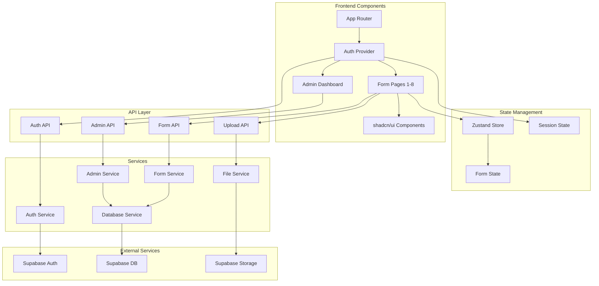

# Components

### Web Application (Frontend)
**Responsibility:** Next.js 15.3 application providing the user interface for travel request submission, authentication, and admin dashboard

**Key Interfaces:**
- Server Components for initial page rendering
- Client Components for interactive form elements
- API route calls via fetch with Supabase auth headers

**Dependencies:** Supabase Client, API Routes

**Technology Stack:** Next.js 15.3, React 19, TypeScript, TailwindCSS, shadcn/ui, Zustand

### Authentication Service
**Responsibility:** Manages user authentication, session management, and authorization using Supabase Auth

**Key Interfaces:**
- signIn(email, password)
- signInWithOAuth(provider)
- signOut()
- getSession()
- requireAuth() middleware

**Dependencies:** Supabase Auth

**Technology Stack:** Supabase Auth SDK, Next.js middleware

### Form Service
**Responsibility:** Handles form submission logic, validation, draft management, and persistence to database

**Key Interfaces:**
- submitForm(data)
- saveDraft(data)
- getDraft(userId)
- validateFormData(data)

**Dependencies:** Database Service, File Service

**Technology Stack:** Next.js API Routes, Zod validation, Supabase Client

### File Service
**Responsibility:** Manages file uploads for passport images and flight suggestions

**Key Interfaces:**
- uploadFile(file, category)
- getFileUrl(fileId)
- deleteFile(fileId)
- validateFile(file)

**Dependencies:** Supabase Storage

**Technology Stack:** Supabase Storage SDK, Next.js API Routes

### Admin Service
**Responsibility:** Provides administrative functions for viewing and managing travel requests

**Key Interfaces:**
- listRequests(filters, pagination)
- getRequestDetails(id)
- updateRequestStatus(id, status, comment)
- exportRequests(format, filters)

**Dependencies:** Database Service, Auth Service

**Technology Stack:** Next.js API Routes, Supabase Client with RLS

### Database Service
**Responsibility:** Abstract database operations with Supabase PostgreSQL

**Key Interfaces:**
- Supabase Client instance
- Row Level Security policies
- Database migrations
- Real-time subscriptions (future)

**Dependencies:** Supabase

**Technology Stack:** Supabase JS Client, PostgreSQL

### Component Diagrams


