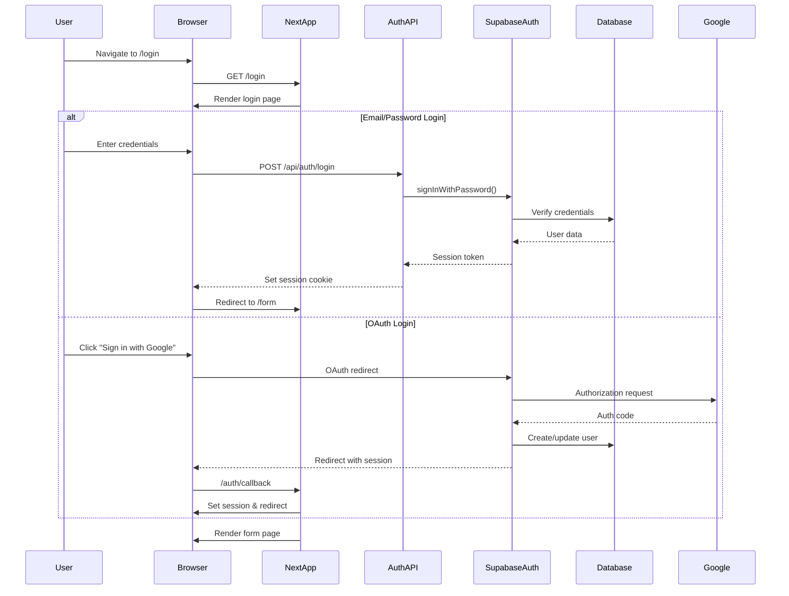
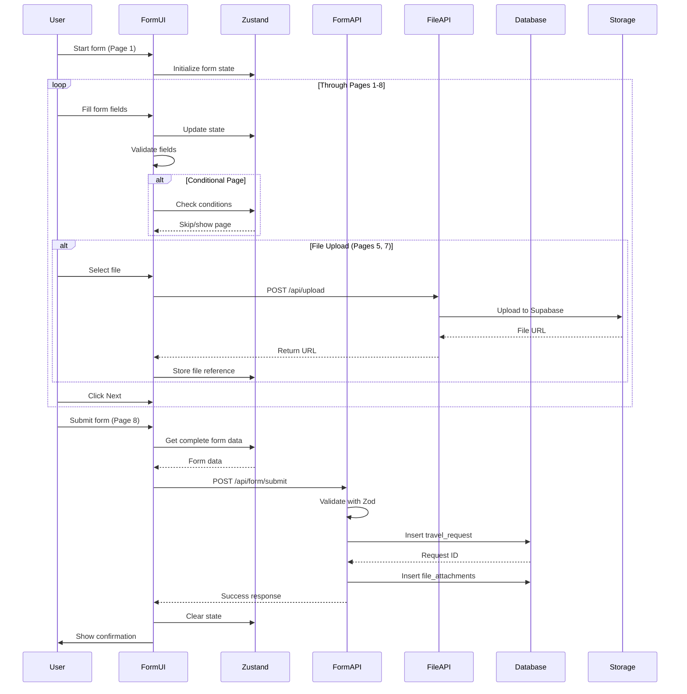
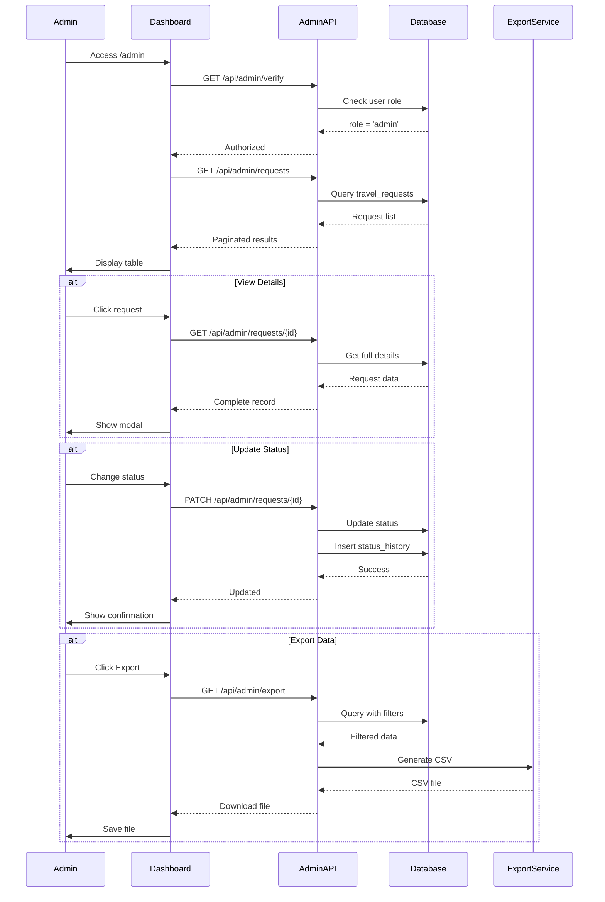

# Core Workflows

### User Authentication Flow

```mermaid
sequenceDiagram
    participant User
    participant Browser
    participant NextApp
    participant AuthAPI
    participant SupabaseAuth
    participant Database
    
    User->>Browser: Navigate to /login
    Browser->>NextApp: GET /login
    NextApp->>Browser: Render login page
    
    alt Email/Password Login
        User->>Browser: Enter credentials
        Browser->>AuthAPI: POST /api/auth/login
        AuthAPI->>SupabaseAuth: signInWithPassword()
        SupabaseAuth->>Database: Verify credentials
        Database-->>SupabaseAuth: User data
        SupabaseAuth-->>AuthAPI: Session token
        AuthAPI-->>Browser: Set session cookie
        Browser->>NextApp: Redirect to /form
    else OAuth Login
        User->>Browser: Click "Sign in with Google"
        Browser->>SupabaseAuth: OAuth redirect
        SupabaseAuth->>Google: Authorization request
        Google-->>SupabaseAuth: Auth code
        SupabaseAuth->>Database: Create/update user
        SupabaseAuth-->>Browser: Redirect with session
        Browser->>NextApp: /auth/callback
        NextApp->>Browser: Set session & redirect
    end
    
    NextApp->>Browser: Render form page
```

### Multi-Step Form Submission Flow

```mermaid
sequenceDiagram
    participant User
    participant FormUI
    participant Zustand
    participant FormAPI
    participant FileAPI
    participant Database
    participant Storage
    
    User->>FormUI: Start form (Page 1)
    FormUI->>Zustand: Initialize form state
    
    loop Through Pages 1-8
        User->>FormUI: Fill form fields
        FormUI->>Zustand: Update state
        FormUI->>FormUI: Validate fields
        
        alt Conditional Page
            FormUI->>Zustand: Check conditions
            Zustand-->>FormUI: Skip/show page
        end
        
        alt File Upload (Pages 5, 7)
            User->>FormUI: Select file
            FormUI->>FileAPI: POST /api/upload
            FileAPI->>Storage: Upload to Supabase
            Storage-->>FileAPI: File URL
            FileAPI-->>FormUI: Return URL
            FormUI->>Zustand: Store file reference
        end
        
        User->>FormUI: Click Next
    end
    
    User->>FormUI: Submit form (Page 8)
    FormUI->>Zustand: Get complete form data
    Zustand-->>FormUI: Form data
    FormUI->>FormAPI: POST /api/form/submit
    FormAPI->>FormAPI: Validate with Zod
    FormAPI->>Database: Insert travel_request
    Database-->>FormAPI: Request ID
    FormAPI->>Database: Insert file_attachments
    FormAPI-->>FormUI: Success response
    FormUI->>Zustand: Clear state
    FormUI->>User: Show confirmation
```

### Admin Dashboard Workflow

```mermaid
sequenceDiagram
    participant Admin
    participant Dashboard
    participant AdminAPI
    participant Database
    participant ExportService
    
    Admin->>Dashboard: Access /admin
    Dashboard->>AdminAPI: GET /api/admin/verify
    AdminAPI->>Database: Check user role
    Database-->>AdminAPI: role = 'admin'
    AdminAPI-->>Dashboard: Authorized
    
    Dashboard->>AdminAPI: GET /api/admin/requests
    AdminAPI->>Database: Query travel_requests
    Database-->>AdminAPI: Request list
    AdminAPI-->>Dashboard: Paginated results
    Dashboard->>Admin: Display table
    
    alt View Details
        Admin->>Dashboard: Click request
        Dashboard->>AdminAPI: GET /api/admin/requests/{id}
        AdminAPI->>Database: Get full details
        Database-->>AdminAPI: Request data
        AdminAPI-->>Dashboard: Complete record
        Dashboard->>Admin: Show modal
    end
    
    alt Update Status
        Admin->>Dashboard: Change status
        Dashboard->>AdminAPI: PATCH /api/admin/requests/{id}
        AdminAPI->>Database: Update status
        AdminAPI->>Database: Insert status_history
        Database-->>AdminAPI: Success
        AdminAPI-->>Dashboard: Updated
        Dashboard->>Admin: Show confirmation
    end
    
    alt Export Data
        Admin->>Dashboard: Click Export
        Dashboard->>AdminAPI: GET /api/admin/export
        AdminAPI->>Database: Query with filters
        Database-->>AdminAPI: Filtered data
        AdminAPI->>ExportService: Generate CSV
        ExportService-->>AdminAPI: CSV file
        AdminAPI-->>Dashboard: Download file
        Dashboard->>Admin: Save file
    end
```

