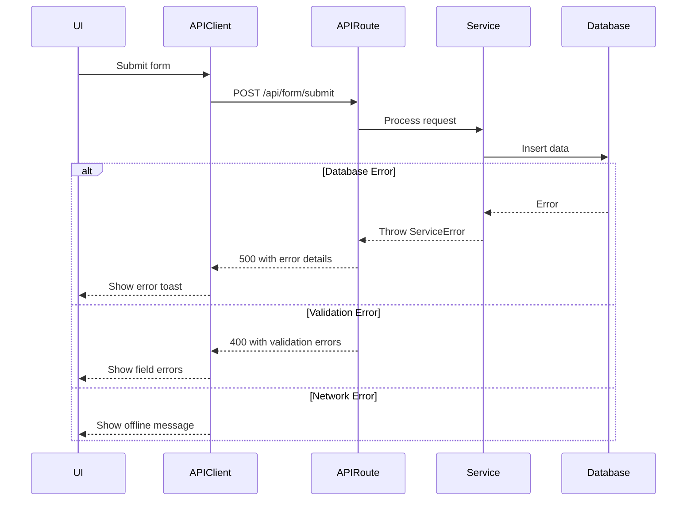

# Error Handling Strategy

### Error Flow


### Error Response Format
```typescript
interface ApiError {
  error: {
    code: string;
    message: string;
    details?: Record<string, any>;
    timestamp: string;
    requestId: string;
  };
}
```

### Frontend Error Handling
```typescript
// lib/error-handler.ts
export class ApiError extends Error {
  constructor(
    public code: string,
    public message: string,
    public details?: any
  ) {
    super(message);
  }
}

export async function handleApiResponse<T>(response: Response): Promise<T> {
  if (!response.ok) {
    const error = await response.json();
    throw new ApiError(
      error.error?.code || 'UNKNOWN_ERROR',
      error.error?.message || 'Algo deu errado',
      error.error?.details
    );
  }
  return response.json();
}

// Usage in component
try {
  const result = await formService.submitForm(data);
} catch (error) {
  if (error instanceof ApiError) {
    if (error.code === 'VALIDATION_ERROR') {
      // Show field-specific errors
      setFieldErrors(error.details);
    } else {
      // Show general error toast
      toast.error(error.message);
    }
  }
}
```

### Backend Error Handling
```typescript
// lib/api-error-handler.ts
export class ApiError extends Error {
  constructor(
    public statusCode: number,
    public code: string,
    message: string,
    public details?: any
  ) {
    super(message);
  }
}

export function errorHandler(error: unknown): NextResponse {
  console.error('API Error:', error);
  
  if (error instanceof ApiError) {
    return NextResponse.json(
      {
        error: {
          code: error.code,
          message: error.message,
          details: error.details,
          timestamp: new Date().toISOString(),
          requestId: crypto.randomUUID(),
        },
      },
      { status: error.statusCode }
    );
  }
  
  if (error instanceof z.ZodError) {
    return NextResponse.json(
      {
        error: {
          code: 'VALIDATION_ERROR',
          message: 'Dados inválidos',
          details: error.errors,
          timestamp: new Date().toISOString(),
          requestId: crypto.randomUUID(),
        },
      },
      { status: 400 }
    );
  }
  
  return NextResponse.json(
    {
      error: {
        code: 'INTERNAL_ERROR',
        message: 'Erro interno do servidor',
        timestamp: new Date().toISOString(),
        requestId: crypto.randomUUID(),
      },
    },
    { status: 500 }
  );
}
```

