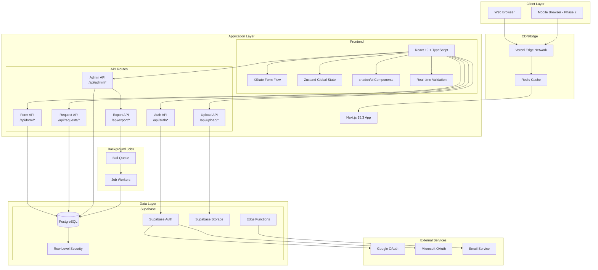

# High Level Architecture

### Technical Summary

The Travel Request Form System employs a **monolithic Next.js 15.3 architecture** deployed as a single fullstack application with integrated API routes, leveraging Supabase for authentication, database, and file storage. The frontend utilizes React 19 with TypeScript, shadcn/ui components, XState for complex form flow management, and Zustand for global state to deliver a conditional multi-step form experience with real-time validation. Backend functionality is implemented through Next.js API routes connecting to a local Supabase PostgreSQL instance, with Row Level Security policies ensuring data isolation, comprehensive audit logging, and support for bulk operations. The infrastructure leverages Docker for local Supabase deployment and targets Node.js-compatible hosting platforms, achieving the PRD goals of replicating Microsoft Forms functionality while adding database persistence, advanced admin capabilities, and setting foundation for future mobile and analytics enhancements.

### Platform and Infrastructure Choice

**Platform:** Local Development with Supabase + Production on Vercel
**Key Services:** 
- Supabase (PostgreSQL, Auth, Storage)
- Next.js 15.3 with App Router
- Vercel for production hosting
- Docker Desktop for local Supabase

**Deployment Host and Regions:** 
- Development: Local Docker containers
- Production: Vercel (Global Edge Network)
- Database: Supabase Cloud (South America region for CEIA)

### Repository Structure

**Structure:** Monorepo
**Monorepo Tool:** Turborepo
**Package Organization:** 
- apps/web (Next.js application)
- packages/shared (shared types and utilities)
- packages/ui (shared components if needed)

### High Level Architecture Diagram

### Architectural Patterns

- **Jamstack Architecture:** Static generation where possible with dynamic API routes - _Rationale:_ Optimal performance for form pages while maintaining dynamic data capabilities
- **Component-Based UI:** Reusable React components with TypeScript and shadcn/ui - _Rationale:_ Maintainability, type safety, and consistent design system
- **State Machine Pattern:** XState for complex conditional form flow - _Rationale:_ Predictable navigation logic handling all conditional paths and business rules
- **Server Components:** Next.js 15 Server Components for initial data fetching - _Rationale:_ Reduced client bundle size and improved initial load performance
- **API Routes Pattern:** Next.js API routes as backend - _Rationale:_ Simplified deployment and unified codebase for MVP
- **Dual State Management:** XState for form flow, Zustand for global app state - _Rationale:_ Separation of concerns between workflow and application state
- **Row Level Security:** Supabase RLS for data isolation - _Rationale:_ Database-level security ensuring users only access their data
- **Categorized File Upload:** Separate storage buckets for passports and flight documents - _Rationale:_ Better organization and access control for different document types
- **Event-Driven Architecture:** Bull queues for async operations - _Rationale:_ Non-blocking exports and email notifications
- **Progressive Enhancement:** Form works without JavaScript where possible - _Rationale:_ Accessibility and reliability for government users
- **Audit Trail Pattern:** Complete status history tracking - _Rationale:_ Compliance requirements and transparency for approval workflows
- **Session Management Pattern:** Active session monitoring with warnings - _Rationale:_ Prevent data loss and improve security for sensitive government data

