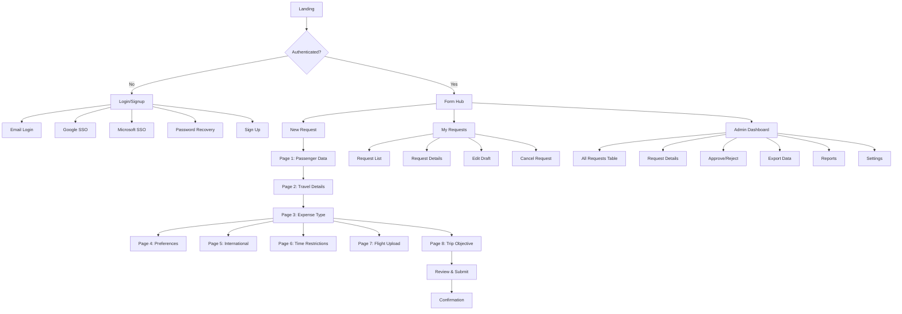

# Travel Request Form System UI/UX Specification

## Introduction

This document defines the user experience goals, information architecture, user flows, and visual design specifications for Travel Request Form System's user interface. It serves as the foundation for visual design and frontend development, ensuring a cohesive and user-centered experience.

### Overall UX Goals & Principles

#### Target User Personas

1. **Employee Traveler:** Company employees who need to request travel arrangements for business trips. They want a quick, straightforward process with clear guidance in Portuguese.

2. **Administrative Assistant:** Support staff who may submit travel requests on behalf of executives or teams. They need efficiency for multiple submissions and clear status tracking.

3. **Travel Administrator:** HR/Finance staff who review and approve travel requests. They need comprehensive dashboards with filtering, search, and bulk management capabilities.

#### Usability Goals

- **Ease of learning:** New users can complete a travel request within 10 minutes on first use
- **Efficiency of use:** Returning users can submit a request in under 5 minutes
- **Error prevention:** Real-time validation in Portuguese prevents submission errors
- **Memorability:** Multi-page flow with clear progress indicators aids navigation
- **Satisfaction:** Clean, professional interface that matches company branding

#### Design Principles

1. **Familiar patterns over innovation** - Maintain consistency with Microsoft Forms experience users know
2. **Progressive disclosure** - Multi-page flow reveals only relevant fields based on selections
3. **Clear communication in Portuguese** - All labels, messages, and feedback in native language
4. **Mobile-ready architecture** - Design desktop-first but structure for Phase 2 mobile
5. **Trust through transparency** - Show progress, provide confirmations, maintain data visibility

### Change Log

| Date | Version | Description | Author |
|------|---------|-------------|--------|
| 2025-08-11 | 1.0 | Initial specification created | Sally (UX Expert) |

## Information Architecture (IA)

### Site Map / Screen Inventory

### Navigation Structure

**Primary Navigation:** 
- Pre-auth: Simple header with logo and login button
- Post-auth: Horizontal nav with: Nova Solicitação | Minhas Solicitações | Dashboard Admin (role-based) | User Menu (profile, logout)

**Secondary Navigation:** 
- Form pages: Progress indicator (dots) + breadcrumb showing "Página X de 8"
- Dashboard: Filter bar + action buttons contextual to current view
- Mobile (Phase 2): Hamburger menu with same structure

**Breadcrumb Strategy:** 
- Show current position in multi-page form (e.g., "Solicitação > Dados do Passageiro")
- Allow backward navigation without data loss
- Disable forward navigation to incomplete pages

*Note: Detailed page inventory with all fields is documented in [User Flows and Wireframes](./ux-design/user-flows-and-wireframes.md)*