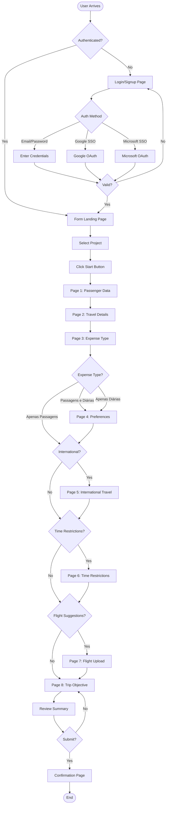
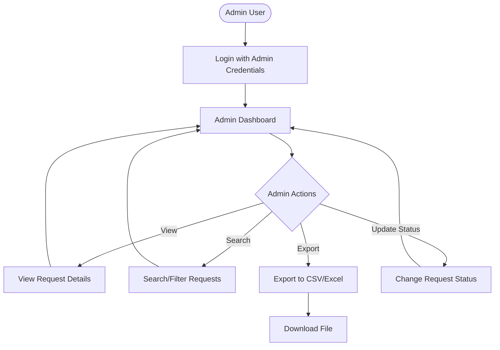

# Travel Request Form System - User Flows and Wireframes

## 1. User Flow Diagram

### Main User Journey



### Admin User Flow



## 2. Wireframes

### Authentication Screens

#### Login/Signup Page
```
┌─────────────────────────────────────────────────────────────┐
│  [CEIA Logo]                                               │
│                                                             │
│  ┌─────────────────────────────────────────────────────┐  │
│  │                                                      │  │
│  │           Sistema de Solicitação de Viagens         │  │
│  │                                                      │  │
│  │  ┌────────────────────────────────────────────┐    │  │
│  │  │  Email: ___________________________        │    │  │
│  │  └────────────────────────────────────────────┘    │  │
│  │                                                      │  │
│  │  ┌────────────────────────────────────────────┐    │  │
│  │  │  Senha: ___________________________        │    │  │
│  │  └────────────────────────────────────────────┘    │  │
│  │                                                      │  │
│  │  [ ] Lembrar-me                                     │  │
│  │  [Esqueceu a senha?]                               │  │
│  │                                                      │  │
│  │  ┌────────────────────────────────────────────┐    │  │
│  │  │           [  ENTRAR  ]                      │    │  │
│  │  └────────────────────────────────────────────┘    │  │
│  │                                                      │  │
│  │  ─────────────── OU ──────────────               │  │
│  │                                                      │  │
│  │  ┌────────────────────────────────────────────┐    │  │
│  │  │    [G] Entrar com Google                    │    │  │
│  │  └────────────────────────────────────────────┘    │  │
│  │                                                      │  │
│  │  ┌────────────────────────────────────────────┐    │  │
│  │  │    [M] Entrar com Microsoft                 │    │  │
│  │  └────────────────────────────────────────────┘    │  │
│  │                                                      │  │
│  │  Não tem conta? [Cadastre-se]                      │  │
│  │                                                      │  │
│  └─────────────────────────────────────────────────────┘  │
│                                                             │
│  Background: Gradient wave pattern (cyan to purple)        │
└─────────────────────────────────────────────────────────────┘
```

### Form Pages

#### Page 1: Passenger Data
```
┌─────────────────────────────────────────────────────────────┐
│  [CEIA Logo]                         [User Menu ▼]         │
│  Solicitação de Viagem              João Silva             │
│                                                             │
│  Progress: [●][○][○][○][○][○][○][○]  Página 1 de 8        │
│                                                             │
│  ┌─────────────────────────────────────────────────────┐  │
│  │                                                      │  │
│  │            Dados do Passageiro                       │  │
│  │                                                      │  │
│  │  Nome Completo *                                     │  │
│  │  ┌────────────────────────────────────────────┐    │  │
│  │  │ __________________________________________ │    │  │
│  │  └────────────────────────────────────────────┘    │  │
│  │                                                      │  │
│  │  CPF *                                              │  │
│  │  ┌────────────────────────────────────────────┐    │  │
│  │  │ ___.___.___-__ │                             │    │  │
│  │  └────────────────────────────────────────────┘    │  │
│  │                                                      │  │
│  │  Email *                                            │  │
│  │  ┌────────────────────────────────────────────┐    │  │
│  │  │ __________________________________________ │    │  │
│  │  └────────────────────────────────────────────┘    │  │
│  │                                                      │  │
│  │  Telefone *                                         │  │
│  │  ┌────────────────────────────────────────────┐    │  │
│  │  │ (__) _____-____ │                            │    │  │
│  │  └────────────────────────────────────────────┘    │  │
│  │                                                      │  │
│  │  Data de Nascimento *                               │  │
│  │  ┌────────────────────────────────────────────┐    │  │
│  │  │ __/__/____ │                                 │    │  │
│  │  └────────────────────────────────────────────┘    │  │
│  │                                                      │  │
│  │  Cargo/Função *                                     │  │
│  │  ┌────────────────────────────────────────────┐    │  │
│  │  │ __________________________________________ │    │  │
│  │  └────────────────────────────────────────────┘    │  │
│  │                                                      │  │
│  │  * Campos obrigatórios                              │  │
│  │                                                      │  │
│  └─────────────────────────────────────────────────────┘  │
│                                                             │
│              [Cancelar]            [Próximo →]             │
│                                                             │
└─────────────────────────────────────────────────────────────┐
```

#### Page 2: Travel Details
```
┌─────────────────────────────────────────────────────────────┐
│  [CEIA Logo]                         [User Menu ▼]         │
│  Solicitação de Viagem              João Silva             │
│                                                             │
│  Progress: [●][●][○][○][○][○][○][○]  Página 2 de 8        │
│                                                             │
│  ┌─────────────────────────────────────────────────────┐  │
│  │                                                      │  │
│  │            Detalhes da Viagem                       │  │
│  │                                                      │  │
│  │  Cidade de Origem *                                 │  │
│  │  ┌────────────────────────────────────────────┐    │  │
│  │  │ [Dropdown: Selecione a cidade ▼]          │    │  │
│  │  └────────────────────────────────────────────┘    │  │
│  │                                                      │  │
│  │  Cidade de Destino *                                │  │
│  │  ┌────────────────────────────────────────────┐    │  │
│  │  │ [Dropdown: Selecione a cidade ▼]          │    │  │
│  │  └────────────────────────────────────────────┘    │  │
│  │                                                      │  │
│  │  [ ] Viagem Internacional                           │  │
│  │                                                      │  │
│  │  Data de Ida *                                      │  │
│  │  ┌────────────────────────────────────────────┐    │  │
│  │  │ [📅] __/__/____ │                           │    │  │
│  │  └────────────────────────────────────────────┘    │  │
│  │                                                      │  │
│  │  Data de Volta *                                    │  │
│  │  ┌────────────────────────────────────────────┐    │  │
│  │  │ [📅] __/__/____ │                           │    │  │
│  │  └────────────────────────────────────────────┘    │  │
│  │                                                      │  │
│  │  Projeto/Centro de Custo *                          │  │
│  │  ┌────────────────────────────────────────────┐    │  │
│  │  │ [Dropdown: Selecione o projeto ▼]         │    │  │
│  │  └────────────────────────────────────────────┘    │  │
│  │                                                      │  │
│  │  * Campos obrigatórios                              │  │
│  │                                                      │  │
│  └─────────────────────────────────────────────────────┘  │
│                                                             │
│        [← Anterior]     [Cancelar]     [Próximo →]        │
│                                                             │
└─────────────────────────────────────────────────────────────┘
```

#### Page 3: Expense Type
```
┌─────────────────────────────────────────────────────────────┐
│  [CEIA Logo]                         [User Menu ▼]         │
│  Solicitação de Viagem              João Silva             │
│                                                             │
│  Progress: [●][●][●][○][○][○][○][○]  Página 3 de 8        │
│                                                             │
│  ┌─────────────────────────────────────────────────────┐  │
│  │                                                      │  │
│  │            Tipo de Despesa                          │  │
│  │                                                      │  │
│  │  Selecione o tipo de solicitação: *                 │  │
│  │                                                      │  │
│  │  ┌────────────────────────────────────────────┐    │  │
│  │  │                                             │    │  │
│  │  │  ( ) Passagens e Diárias                   │    │  │
│  │  │      Solicitar passagens aéreas e diárias  │    │  │
│  │  │                                             │    │  │
│  │  └────────────────────────────────────────────┘    │  │
│  │                                                      │  │
│  │  ┌────────────────────────────────────────────┐    │  │
│  │  │                                             │    │  │
│  │  │  ( ) Apenas Passagens                      │    │  │
│  │  │      Solicitar somente passagens aéreas    │    │  │
│  │  │                                             │    │  │
│  │  └────────────────────────────────────────────┘    │  │
│  │                                                      │  │
│  │  ┌────────────────────────────────────────────┐    │  │
│  │  │                                             │    │  │
│  │  │  ( ) Apenas Diárias                        │    │  │
│  │  │      Solicitar somente diárias             │    │  │
│  │  │                                             │    │  │
│  │  └────────────────────────────────────────────┘    │  │
│  │                                                      │  │
│  │  * Campo obrigatório                                │  │
│  │                                                      │  │
│  └─────────────────────────────────────────────────────┘  │
│                                                             │
│        [← Anterior]     [Cancelar]     [Próximo →]        │
│                                                             │
└─────────────────────────────────────────────────────────────┘
```

#### Page 5: International Travel (Conditional)
```
┌─────────────────────────────────────────────────────────────┐
│  [CEIA Logo]                         [User Menu ▼]         │
│  Solicitação de Viagem              João Silva             │
│                                                             │
│  Progress: [●][●][●][●][●][○][○][○]  Página 5 de 8        │
│                                                             │
│  ┌─────────────────────────────────────────────────────┐  │
│  │                                                      │  │
│  │         Viagem Internacional                        │  │
│  │                                                      │  │
│  │  Número do Passaporte *                             │  │
│  │  ┌────────────────────────────────────────────┐    │  │
│  │  │ __________________________________________ │    │  │
│  │  └────────────────────────────────────────────┘    │  │
│  │                                                      │  │
│  │  Data de Validade do Passaporte *                   │  │
│  │  ┌────────────────────────────────────────────┐    │  │
│  │  │ [📅] __/__/____ │                           │    │  │
│  │  └────────────────────────────────────────────┘    │  │
│  │                                                      │  │
│  │  [ ] Precisa de visto?                              │  │
│  │                                                      │  │
│  │  Status do Visto                                    │  │
│  │  ┌────────────────────────────────────────────┐    │  │
│  │  │ [Dropdown: Selecione ▼]                   │    │  │
│  │  │ - Em processo                              │    │  │
│  │  │ - Aprovado                                 │    │  │
│  │  │ - Pendente                                 │    │  │
│  │  └────────────────────────────────────────────┘    │  │
│  │                                                      │  │
│  │  Upload da Cópia do Passaporte                      │  │
│  │  ┌────────────────────────────────────────────┐    │  │
│  │  │ [📎 Escolher arquivo]                      │    │  │
│  │  │ Máx: 10MB (JPG, PNG, PDF)                 │    │  │
│  │  └────────────────────────────────────────────┘    │  │
│  │                                                      │  │
│  │  * Campos obrigatórios                              │  │
│  │                                                      │  │
│  └─────────────────────────────────────────────────────┘  │
│                                                             │
│        [← Anterior]     [Cancelar]     [Próximo →]        │
│                                                             │
└─────────────────────────────────────────────────────────────┘
```

#### Page 8: Trip Objective (Final Page)
```
┌─────────────────────────────────────────────────────────────┐
│  [CEIA Logo]                         [User Menu ▼]         │
│  Solicitação de Viagem              João Silva             │
│                                                             │
│  Progress: [●][●][●][●][●][●][●][●]  Página 8 de 8        │
│                                                             │
│  ┌─────────────────────────────────────────────────────┐  │
│  │                                                      │  │
│  │            Objetivo da Viagem                       │  │
│  │                                                      │  │
│  │  Justificativa da Viagem *                          │  │
│  │  ┌────────────────────────────────────────────┐    │  │
│  │  │ __________________________________________ │    │  │
│  │  │ __________________________________________ │    │  │
│  │  │ __________________________________________ │    │  │
│  │  │ __________________________________________ │    │  │
│  │  │ __________________________________________ │    │  │
│  │  └────────────────────────────────────────────┘    │  │
│  │  Mín: 50 caracteres                                 │  │
│  │                                                      │  │
│  │  Observações Adicionais                             │  │
│  │  ┌────────────────────────────────────────────┐    │  │
│  │  │ __________________________________________ │    │  │
│  │  │ __________________________________________ │    │  │
│  │  │ __________________________________________ │    │  │
│  │  └────────────────────────────────────────────┘    │  │
│  │                                                      │  │
│  │  [ ] Declaro que todas as informações são           │  │
│  │      verdadeiras e completas                        │  │
│  │                                                      │  │
│  │  * Campos obrigatórios                              │  │
│  │                                                      │  │
│  └─────────────────────────────────────────────────────┘  │
│                                                             │
│     [← Anterior]    [Cancelar]    [Revisar e Enviar]      │
│                                                             │
└─────────────────────────────────────────────────────────────┘
```

### Confirmation Screen
```
┌─────────────────────────────────────────────────────────────┐
│  [CEIA Logo]                         [User Menu ▼]         │
│  Solicitação de Viagem              João Silva             │
│                                                             │
│  ┌─────────────────────────────────────────────────────┐  │
│  │                                                      │  │
│  │         ✓ Solicitação Enviada com Sucesso!          │  │
│  │                                                      │  │
│  │  Número do Protocolo:                               │  │
│  │  ┌────────────────────────────────────────────┐    │  │
│  │  │         REQ-2024-CUID-12345                │    │  │
│  │  └────────────────────────────────────────────┘    │  │
│  │                                                      │  │
│  │  Resumo da Solicitação:                             │  │
│  │  ┌────────────────────────────────────────────┐    │  │
│  │  │ Passageiro: João Silva                     │    │  │
│  │  │ Origem: São Paulo                          │    │  │
│  │  │ Destino: Rio de Janeiro                    │    │  │
│  │  │ Data Ida: 15/03/2024                       │    │  │
│  │  │ Data Volta: 18/03/2024                     │    │  │
│  │  │ Tipo: Passagens e Diárias                  │    │  │
│  │  │ Status: Pendente Aprovação                 │    │  │
│  │  └────────────────────────────────────────────┘    │  │
│  │                                                      │  │
│  │  Um email de confirmação foi enviado para:          │  │
│  │  joao.silva@exemplo.com                             │  │
│  │                                                      │  │
│  │  [📥 Baixar PDF]    [📧 Enviar por Email]          │  │
│  │                                                      │  │
│  └─────────────────────────────────────────────────────┘  │
│                                                             │
│       [Nova Solicitação]        [Ir para Dashboard]       │
│                                                             │
└─────────────────────────────────────────────────────────────┘
```

### Admin Dashboard
```
┌─────────────────────────────────────────────────────────────┐
│  [CEIA Logo]           Dashboard Administrativo            │
│                                         Admin: Maria Silva │
│                                                             │
│  ┌──────────────────────────────────────────────────────┐ │
│  │ Filtros:                                            │ │
│  │ [Status ▼] [Projeto ▼] [Data ▼] [🔍 Buscar...]    │ │
│  └──────────────────────────────────────────────────────┘ │
│                                                             │
│  ┌──────────────────────────────────────────────────────┐ │
│  │ ID      | Passageiro  | Destino | Data    | Status  │ │
│  │─────────┼─────────────┼─────────┼─────────┼─────────│ │
│  │ REQ-001 | João Silva  | Rio     | 15/03   | Pendente│ │
│  │ REQ-002 | Ana Costa   | BSB     | 20/03   | Aprovado│ │
│  │ REQ-003 | Pedro Lima  | NYC     | 25/03   | Pendente│ │
│  │ REQ-004 | Maria Souza | SP      | 10/04   | Negado  │ │
│  │ REQ-005 | Carlos Dias | Paris   | 15/04   | Aprovado│ │
│  │                                                      │ │
│  │ [Ações: Ver | Editar | Aprovar | Negar | Exportar]  │ │
│  └──────────────────────────────────────────────────────┘ │
│                                                             │
│  Mostrando 1-5 de 150 registros                           │
│  [← Anterior] [1] [2] [3] ... [30] [Próximo →]           │
│                                                             │
│  [📊 Relatórios] [📥 Exportar CSV] [⚙️ Configurações]    │
│                                                             │
└─────────────────────────────────────────────────────────────┘
```

## 3. Interaction Patterns

### Form Navigation
- **Linear progression** with conditional branching
- **Breadcrumb trail** showing current position
- **Back button** preserves entered data
- **Progress indicator** updates dynamically

### Validation Patterns
- **Real-time validation** on field blur
- **Inline error messages** in Portuguese
- **Required field indicators** with asterisks
- **Format masks** for CPF, phone, dates
- **Submit button disabled** until valid

### File Upload Interaction
1. Click "Choose File" button
2. File selector opens (filtered for allowed types)
3. Preview thumbnail appears after selection
4. Upload progress bar during submission
5. Success checkmark or error message

### Conditional Logic Rules
- **International Travel**: Shows Page 5 if checkbox selected on Page 2
- **Time Restrictions**: Shows Page 6 based on user preference
- **Flight Suggestions**: Shows Page 7 if user wants to upload preferences
- **Expense Type Routing**:
  - "Passagens e Diárias" → Full flow
  - "Apenas Passagens" → Skip per diem sections
  - "Apenas Diárias" → Skip flight-specific sections

## 4. Responsive Behavior

### Desktop (1024px+)
- Full-width form cards with padding
- Side-by-side field layout where appropriate
- Fixed 800px max-width for readability

### Tablet (768px-1023px)
- Single column layout
- Full-width form fields
- Stacked navigation buttons

### Mobile Considerations (Phase 2)
- Vertical stack all elements
- Touch-optimized buttons (44px min)
- Simplified navigation
- Native date/time pickers

## 5. Accessibility Notes

While not required for Phase 1, consider:
- Keyboard navigation support
- ARIA labels for screen readers
- Color contrast ratios (WCAG AA)
- Focus indicators
- Error announcements

## 6. Visual Design System

### Colors
- **Primary**: #0066CC (Blue for CTAs)
- **Secondary**: #6B46C1 (Purple accents)
- **Success**: #10B981 (Green)
- **Error**: #EF4444 (Red)
- **Background**: Gradient overlay on image
- **Card Background**: White with 95% opacity

### Typography
- **Headers**: Inter Bold, 24px
- **Subheaders**: Inter Semibold, 18px
- **Body**: Inter Regular, 14px
- **Labels**: Inter Medium, 12px
- **Errors**: Inter Regular, 12px (Red)

### Components
- **Input Fields**: 40px height, 8px radius, 1px border
- **Buttons**: 44px height, 8px radius, shadow on hover
- **Cards**: 16px padding, 12px radius, subtle shadow
- **Progress Bar**: 4px height, rounded ends

### Spacing
- **Page Padding**: 24px
- **Section Spacing**: 32px
- **Field Spacing**: 20px
- **Label to Field**: 8px

## 7. State Management

### Form States
- **Empty**: Initial state, no data
- **Partial**: Some fields completed
- **Valid**: All required fields valid
- **Submitting**: Processing request
- **Error**: Validation or submission errors
- **Success**: Successfully submitted

### Field States
- **Default**: Empty or filled
- **Focus**: Blue border highlight
- **Error**: Red border with message
- **Disabled**: Grayed out
- **Loading**: Spinner indicator

## 8. Error Handling

### Field-Level Errors
- Display immediately on blur
- Clear, specific messages in Portuguese
- Highlight field with red border
- Icon indicator next to label

### Page-Level Errors
- Toast notification for system errors
- Inline alert for submission failures
- Retry button for network issues
- Contact support option

### Success Feedback
- Green checkmark animations
- Success toast messages
- Confirmation page with details
- Email confirmation sent

## 9. Performance Considerations

### Optimization Strategies
- Lazy load form pages
- Cache dropdown options
- Debounce validation calls
- Compress uploaded images
- Progressive form submission

### Loading States
- Skeleton screens for initial load
- Spinner for async operations
- Progress bar for file uploads
- Optimistic UI updates

## 10. Security Considerations

### Data Protection
- HTTPS for all communications
- Token-based authentication
- Session timeout warnings
- Secure file upload validation
- Input sanitization

### User Privacy
- Mask sensitive data (CPF partial display)
- Secure password requirements
- OAuth provider compliance
- Audit trail for admin actions
- Data retention policies